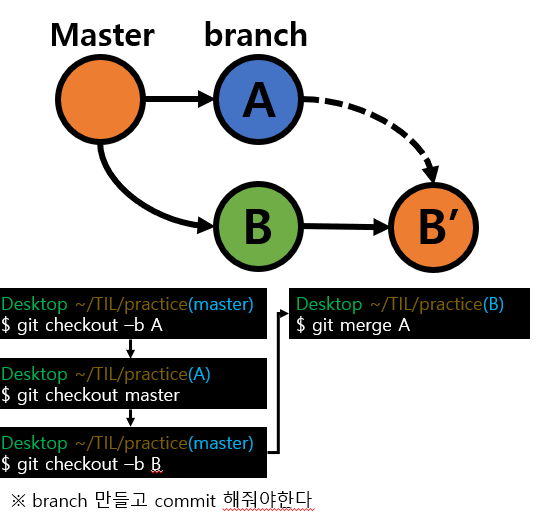

## 2022-09-13

### RPA 1기, 웹프로그래밍 기획과 기본

#### 리눅스 커맨드라인 기초

- `pwd` : print working directory 현재 작업 경로를 출력해주는 명령어
- `cd` : change directory 현재 작업 경로를 변경할 때 쓰는 명령어
  - 절대 경로는 `/`로 시작함
  - 상위 경로는 `..`으로 나타냄
  - `tab`을 사용하면 경로 자동 완성이 됨
- `ls` : list 현재 작업 경로에 있는 파일이나 디렉터리를 출력해주는 명령어

  - `ls -a`, `ls -l`, `ls -al` 과 같은 옵션을 붙일 수 있음

- `history`: 과거에 쳤던 명령어 리스트를 보여줌
- 123번째 명령어를 복구하고 싶으면 `!123` 입력

#### vim 사용법

- 명령 모드와 입력 모드
- vim 에디터를 열때는 명령 모드로 진입
- 명령 모드에서는 입력이 불가능
- 입력하려면 입력 모드로 변경해야함
- 키보드에서 `i` 누름
- 입력이 끝나고, 저장하고 나오려면 명령 모드로 바꿔야함
- 키보드에서 `ESC` 누름
- 입력 가능한 명령어
- `:w` : 저장하기
- `:q` : 나오기
- `:wq` : 저장하고 나오기
- 참고자료 [링크](https://iamfreeman.tistory.com/entry/vi-vim-%ED%8E%B8%EC%A7%91%EA%B8%B0-%EB%AA%85%EB%A0%B9%EC%96%B4-%EC%A0%95%EB%A6%AC-%EB%8B%A8%EC%B6%95%ED%82%A4-%EB%AA%A8%EC%9D%8C-%EB%AA%A9%EB%A1%9D)
- 비정상 적으로 종료시 해결방법
- vim이 비정상 종료 되었을때 `swp` 파일이 생성됨
- Attention 문구가 뜨는경우

1. 두 프로세스, 두 사람이 동시에 한 파일을 수정하는경우
2. Crash 가 나서 vim 이 비정상적으로 닫힌 경우

- 기존에 입력했던 내용을 복구하고 싶을때는 `vim -r 파일명`을 입력하거나 Recovery모드로 진입
- 정상 종료 후, `swp`파일 삭제
- `rm .123.txt.swp` <-- `rm` 명령어는 remove 약자

#### 마크다운 문법

- 링크 추가[링크](https://heropy.blog/2017/09/30/markdown/)

#### 버전 관리 시스템과 git

#### 버전 관리 시스템을 사용하는 이유

1.  실행 취소, 재 실행이 가능함
2.  버전간 소스코드 비교가 가능함
3.  협업이 쉬워짐

#### 다양한 버전관리 방법

이름 변경하기 등의 방법이 있는데, 개발할 때는 git을 주로 사용함

#### 커밋

- 커밋은 논리적 변경이 있을 때 만듬
- 가능하면 커밋 크기가 작을수록 좋음

#### 커밋 이력보기

```
git log
```

-`q` 입력시 나올 수 있음

#### 리포지토리

- 정의 : 여러 파일을 하나로 모은 컬렉션

# 20220927

#### 브랜치

- Main 이라는 큰 줄기에 변화를 주기전에 가지로 뽑아내서 체크하고 큰 줄기에 적용 시키기 위한 '가지'

- 브랜치 생성과 브랜치로 이동 동시에 하기(브랜치 생성 + 브랜치로 이동(체크아웃))

```
git checkout -b 브랜치명
```

- 브랜치 만들기

```
git branch 브랜치명
```

- 브랜치로 이동하기(체크아웃)

```
git checkout 브랜치명
```

- 주의!!! : 새로운 branch를 만들때는 꼭!! master에 checkout 되어있는지 확인하고 만들어야한다!!!



- 브랜치 병합

  - 브랜치를 병합할때는 현재 내가 체크아웃(작업하는) 되어있는 브랜치가 아닌 다른 브랜치명을 merge 뒤에 써주면 된다.

- 명령어

```
git merge 브랜치명
```

- 예) branch A 와 B를 병합하고 내가 B에 checkout 되어있을 경우

```
doyoon@DESKTOP-O58U3V6 MINGW64 ~/experiment/TIL (B)
$ git merge A
```


- 로컬 저장소에서 원격 저장소로 동기화

```
git push 저장소 브랜치
예) git push origin main
```
