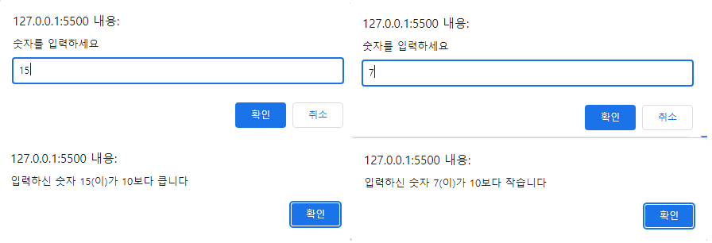
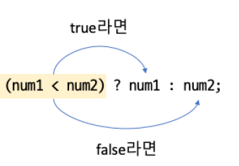

## 제어문

* 소스 실행 순서를 결정하는 명령문이다
* 조건에 따라 순서 조절하기: if, if-else, switch, 조건 연산자 등
* 반복 횟구 조절하기: for, while, do-while
* 소스 흐름에 영향을 주는 문법: continue, break

## IF

* 괄호 안의 조건이 true면 { } 사이의 명령을 처리하고, false면 { } 안의 명령을 무시하고 다음 명령을 처리한다
  
```html
<body>
  <script>
    let a;
    a = prompt("숫자를 입력하세요","");
    if (a > 10){
      alert(`입력하신 숫자 ${a}(이)가 10보다 큽니다`);
    }
    alert(`입력하신 숫자 ${a}(이)가 10보다 작습니다`)
  </script>
</body>
```



## If - else

* if문은 결과값이 true일 때만 실행하므로 true가 아닐 때 명령을 따로 수행할 수 없다
* if - else 문은 if조건의 결과값이 true가 아닐 때 실행할 명령을 else문 다음에 추가한다

```html
<body>
  <script>
    let a;
    a = prompt("숫자를 입력하세요","");
    if (a > 10){
      alert(`입력하신 숫자 ${a}(이)가 10보다 큽니다`);
    }
    else if (a == 10){
      alert(`입력하신 숫자 ${a}(이)가 10입니다`);
    }
    else {
      alert(`입력하신 숫자 ${a}(이)가 10보다 작습니다`);
    }
  </script>
</body>
```

## 조건 연산자

* 조건이 하나이고 실행할 명령도 하나일 떄 조건문을 간단하게 처리하는 연산자


```html
<script>
  a = 100;
  b = 75;
  if (a <= b) {
    alert("b가 더 크다");
  }
  else{
    alert("a가 더 크다")
  }
</script>
```

* 위의 조건문을 아래와 같이 표현할 수 있다
  
```html
<script>
  a=100;
  b=75;
  (a <= b) ? alert("b가 더 크다") : alert("a가 더 크다")
</script>
```

## 두 가지 이상의 조건 체크하기

* 두 개 이상의 조건을 체크해야 할 경우에는 논리 연산자를 사용해 조건식을 만들어야 한다
  * OR 연산자(||): 두 개의 피연산자 중 하나라도 true가 있으면 결과값은 true가 된다
  * AND 연산자(&&): 두 개의 피연산자 중 false가 하나라도 있으면 결과값은 false가 된다
  * NOT 연산자(!): 피연산자의 값과 정반대의 값

* OR 연산자(||)
  
  ```html
  <script>
    a = 10
    b = 20
    a == 10 || b == 25 /*true*/
    a ==25 || b == 20 /*true*/
    a ==15 || b ==25 /*false*/
  </script>
  ```

* AND 연산자(&&)  

```html
  <script>
    a = 10
    b = 20
    a == 10 && b == 20 /*true*/
    a ==25 && b == 20 /*false*/
    a ==10 && b == 25 /*false*/
    a ==15 && b ==25 /*false*/
  </script>
```

* 단축 평가값 활용하기
  * 조건식은 왼쪽에서 오른쪽으로 진행하면서 처리한다
  * 첫 번째 조건만 보고도 true 인지 false인지 결정할 수 있다면 좀 더 빠르게 조건식을 처리할 수 있다
  * 두 가지 이상의 조건을 함께 체크하는 조건식을 만들 때에는 첫 번째 조건을 보고 빠르게 판단할 수 있도록 작성하는 것이 좋다
  * ex) AND연산자(&&)는 하나만 false여도 최종 결과값이 false가 되므로 첫 번째 조건식이 false면 뒤에 오는 조건식은 체크하지 않고 바로 false 결과를 만든다, 즉
  * && 를 사용해서 조건을 체크할 경우에는 false 확률이 높은 조건을 첫 번째 조건식으로 사용하는게 좋다
  * || 를 사용해서 조건을 체크할 경우에는 true 확률이 높은 조건을 첫 번째 조건식으로 사용하는게 좋다