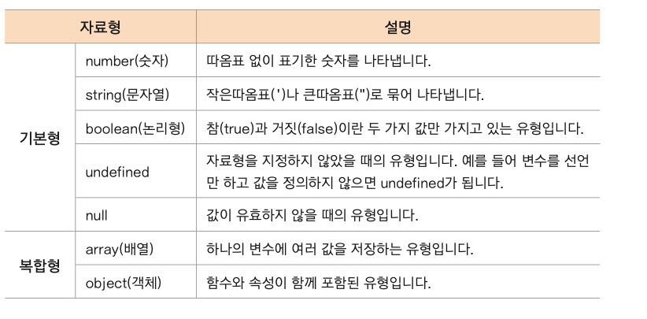

# 자료형(data type)

* 프로그램에서 처리하는 자료의 형태
* 자료형, 자료 유형, data type으로 부른다
* JS 자료형은 크게 원시형 과 객체로 나눈다
  * 원시형(primitive type): 하나의 값만 가지고 있는 자료형
  * 객체(object): 원시형 외에 모든 자료  
  

## typeof()

* JS안에 미리 만들어져 있는 함수로 괄호 안에 값이나 변수를 넣으면 어떤 자료형인지 알려줍니다  
  

## string()

* 작은따옴표(' ')나 큰따옴표(" ")로 묶은 데이터
* 최근에는 (' ')많이 사용한다
* 특수 기호 표시하기  
   

## 탬플릿 리터럴

* 문자열과 변수, 식을 섞어서 하나의 문자열을 만드는 표현 형식
* ES6 이전에는 연결 연산자인 +를 사용해서 식이나 변수를 연결했다
  * 변수나 식이 많아질수록 오타가 나올 확률이 높아진다
* 백팃(` `) 기호를 사용한다
* 변수나 식은 들어간다면 ${}로 묶고, 태그나 띄어쓰기, 이스테이프 문자를 그대로 표시할 수 있기 때문에 사용이 편리하다  
* `<br>, \n`을 사용하지 않고 그냥 줄바꿈 해도 반영된다  
  
   

## 논리형(boolean)

* 참(true), 거짓(false) 값을 표현하기 위한 데이터 유형
* 불린(boolean) 유형이라고도 한다
* 지정한 조건이 맞는지 여부를 확인하는 *조건식* 에서 많이 사용한다
* truthy, falsy
  * true, false라는 명확한 값외에 참과 거짓을 판별하는 방법
  * truthy: true로 인정할 수 있는 값
  * falsy: false로 인정할 수 있는 값
  * falsy값을 제외한 모든값은 truthy,즉 true로 친다  
   
  * NaN: Not a Number(숫자가 아님)
  * undefined: 변수를 선언하기만 하고 값을 할당하지 않았을때 변수의 초기값
    * 값이면서 자료형이다
  * null: 유효하지 않은 값
    * 값이면서 자료형이다

## 객체

* 여러 개의 원시 유형을 하나로 묶어 놓은 것
* 원시 유형 외에는 모두 객체, 함수도 객체다
* property 와 method 라는 것이 있다
  
 ```js
 객체명={
  키 : 값,
  키1: 값,
  ...
 }
 ```

 ## 객체 값에 접근하기

* 객체에 있는 여러 property중 원하는 property값을 가져오려면 마침표(.)를 사용하거나 대괄호([ ])를 사용한다
  
  ```js
  객체명.키
  객체명["키"]
  ```

## 배열(list)

* 하나의 변수에 여러 값을 할당할 수 있는 형태
* 대괄호([ ])로 묶고, 그 안에 값을 나열한다. 각 값은 쉼표(,)로 구분한다
* [ ]비어있어도 빈배열로 배열이다  
  
* 인덱스(index): 배열에 있는 값들을 저장하는 방 번호
* *중요!*  index는 0부터 시작이다 0,1,2,3...  
  
* `season[season.length-1]` : list의 길이는 모르지만 마지막 값을 찾을때 사용

## 심볼(Symbol)

* ES6에 새롭게 추가된 원시 유형의 자료형
* Symbol의 가장 큰 특징은 유일성을 보장한다는 것이다
* Symbol은 한번 만들면 변경할 수도 없고, 같은 값을 가진 심볼을 만들 수도 없다
* Symbol을 키로 사용할 때에는 [키]처럼 대괄호로 묶어서 표현한다
* 키에 접근할 땡도 마침표가 아닌 대괄호로 사용한다  
  

## JavaScript의 형변환

* JS에서는 다른언어와 다르게 프로그램 실행 중에 자료형이 변환되는 경우가 있다
* 자동으로 형이 변환되는 경우를 알아두지 않으면 오류가 발생 되기도 하고 예상값과 다른값이 나올 수 있다

## 자동 형 변환

* 변수에 값을 저장할 때 자료형이 결정되지만 *주의!* 연산을 할때 자료형이 자동으로 변환된다
* 문자열을 연산에 사용하면 자동으로 숫자형으로 변환된다
* 숫자와 문자열을 연결하면 숫자가 문자열로 변환된다

## 숫자형으로 변환 Number(),parseInt(),parseFloat()

* prompt창에서 숫자를 입력받을 경우 직접 숫자로 변환한 후 연산에 사용하는 것이 확실하다
* Number()
* 문자열 뿐만 아니라 null,undefined를 포함해서 모든 자료형을 숫자로 변환할 수 있다  
  
* parseInt(),parseFloat()
  * parseInt( ): 괄호 안의 값을 정수로 변환
  * parseFloat( ): 괄호 안의 값을 실수로 변환

## 문자열로 변환하기 toString(),String()

* toString()
  * null 데이터형과 undefined 데이터형을 제외한 데이터형을 문자열 데이터로 변환
  * 원래값 뒤에 마침표를 붙이고 함수를 작성한다
  * 숫자를 문자열로 변환할 때는 basis옵션을 사용해 숫자가 10진수 인지,2 진수 인지 같이 지정한다  
  * 값.toString()
  * 값.toString(basis)  
  
    

* String()
  * null 데이터형과 undefined 데이터형을 포함해서 문자열 데이터로 변환
  * String()함수의 괄호 안에 값을 넣어서 변환한다
  * null이면 'null' , undefined 면 'undefined'로 변환. 그 외에는 toString()함수와 같다  
  * `String(값)`  
  
    

## 논리형으로 변환하기 Boolean()

* 다른 유형의 데이터를 논리형 데이터로 변환한다
* 함수의 괄호 안에 원래값을 넣는다
* Boolean(값)  
  