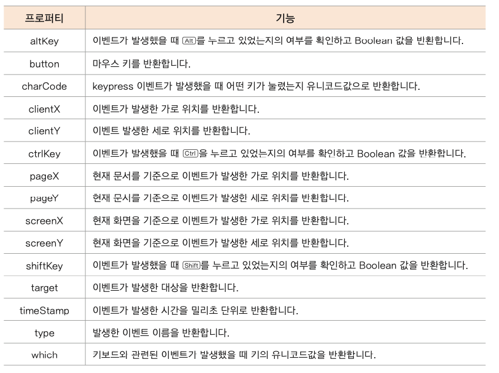

# DOM 문서 객체 모델

* JavaScript를 이용하여 웹 문서에 접근하고 제어할 수 있도록 객체를 사용해 웹 문서를 체계적으로 정리하는 방법
* 웹 문서를 구조화한 DOM tree 와 이벤트 등을 정리해 놓은 표준 [https://dom.spec.whatwg.org/](https://dom.spec.whatwg.org/)
* 웹 문서의 특정 요소에 접근해서 스타일 속성을 조절하거나 JS를 사용해서 동적으로 변화가 생기게 할 수 있다
* ex) 문서 특정위치에 내용표시, 이미지 슬라이드 쇼, 동적인 내비게이션, 모달 박스등 
* 문서에 있는 각 요소를 객체 형태로 처리할 수 있기 때문에 JS를 사용해 웹 문서를 동적으로 다룰 수 있다
* 웹 문서 자체도 객체이고 그 안에 삽입되어있는 이미지와 링크, 텍스트 필드 등도 모두 객체다
* 각 객체마다 속성을 나타내는 property와 동작을 위한 method가 있다
* DOM을 공부하는 것은 각 객체의 특성과 property, method를 알고, 필요할 때마다 property와 method를 적절하게 사용하기 위한 것이다
  
## DOM tree

* 웹 문서에 있는 요소들 간의 부모, 자식 관계를 계층 구조로 표시한 것
* node: DOM tree에서 가지가 갈라져 나간 항목
* root node: DOM tree 의 시작 부분(html)

## DOM을 구성하는 원칙

* 모든 html 태그는 element(요소) 노드
* 웹 문서의 텍스트 내용은 요소 노드의 자식 노드인 text node
* 태그의 속성은 요소 노드의 자식 노드인 attribute node
* 주석은 comment node  
  
  

## 웹 요소에 접근하기

* 웹 문서에서 원하는 요소를 찾아가는 것을 '접근한다(access)'라고 한다
* getElement*()
  * 예전부터 사용하던 방법
  * id값이나 class값, 태그이름을 사용해서 접근한다
* querySelector*()
  * id값이나 class값, 태그 이름을 사용해서 접근
  * 둘 이상의 선택자를 조합해서 사용할 수 있다 ex) #detail>p

* 이 함수들은 모두 document객체에 포함된 함수

```js
 document.getElement ~ (), document.querySelector ~ ()
```

## getElement~

* getElementByld( )

```js
documnet.getElementByld("id명")
```

* getElementsByClassName( )

```js
document.getElementsByClassName("class명")
```

* getElementsByTagName( )

```js
document.getElementsByTagName("태그명")
```

* 클래스와 태그는 여러 번 사용할 수 있기 때문에 반환값이 여러 개 일수 있다
* 여러 개일 경우 HTMLCollection객체에 저장된다(배열과 비슷한 자료 구조)
* 함수 이름에 복수형을 나타내는 -s가 포함 되어있다. !주의!
 

## querySelector

* querySelector(선택자)
* querySelectorAll(선택자)
* 선택자
  * id 이름앞에는 해시기호(#), class 이름 앞에 마침표(.), 태그는 기호 없이 태그명 사용한다
* 반환 값
  * querySelector( ) 메서드는 한 개의 값만 반환
  * querySelecotrAll( ) 메서드는 반환 값이 여러 개일 때 모두 반환 -> 노드 리스트로 저장된다
  
## 웹 요소 내용 가져오기

* 접근한 요소의 내용을 가져오거나 지정할 때는 innerText,innerHTML property 사용
  * innerText: 순수 텍스트를 가져오거나, 해당 요소에 텍스트 지정
  * innerHTML: 태그와 함꼐 텍스트를 가져오거나, 해당 요소에 태그와 함꼐 텍스트 지정
  * textContent: 텍스트를 가져오되, 화면에 보이는대로가 아니라 소스에 있는대로 가져온다
    * 화면에서 감춘 요소에서도 내용을 가져올 수 있고, 소스에 공백이 여러 개일경우 그 공백도 모두가져온다

## getAtrribute( ), setAttribute( )

* getAtrribute( ) - 태그의 속성에 접근해서 값을 가져온다

```js
getAttribute(속성명)
```

* setAtrribute( ) - 태그의 속성 값을 지정한다

```js
setAttribute(속성명,값)
```

## CSS 속성에 접근하기

* JS를 이용하면 스타일 속성의 값을 가져오거나 원하는 값으로 수정할 수 있다
  * 웹 문서에서 다양한 효과를 만들 수 있다
  
  ```JS
  요소.style.속성명
  ```

## classList

* 두 개 이상의 class스타일이 적용되었을 경우 class 스타일 정보를 담아두는 property
* classList를 사용해서 적용 중인 class스타일을 제거할 수도 있고 새로운 class스타일을 추가할 수도 있다
* 새로운 클래스 스타일을 추가하거나(클래스 스타일이 만들어져 있어야한다)
* 기존에 적용 중인 클래스 스타일을 제거할 수 있다

```js
요소.classList.add(클래스명)
요소.classList.remove(클래스명)
```

## 이벤트 리스너

* 이벤트를 처리할 때 HTML태그 안에서 처리하는 방법과 JS에서 '요소.onclick=함수' 처럼 처리하는 방법이있다
* 더 많이 사용하는 방법은 addEventListener( ) 함수를 사용하는 방법이다

```js
요소.addEventListener(이벤트,함수,캡처 여부);
```

* 요소: 이벤트가 발생한 요소
* 이벤트: 이벤트 유형.on을 붙이지 않고 이벤트 이름을 그대로 사용한다
* 함수: 이벤트가 발생했을 때 함수를 지정한다
* 캡처 여부: 이벤트를 캡처링 하는지의 여부를 지정한다. 옵션이므로 후에 설명.

## event 객체

* 이벤트가 발생하면 자동으로 만들어지는 객체
* 이벤트 이름,발생 위치, 발생 시간 등 이벤트와 관련된 여러 정보들을 가지고 있다
* 이벤트 객체의 메서드
  * preventDefault: (취소할 수 있을경우) 기본동작을 취소합니다
* 이벤트 객체의 프로퍼티
