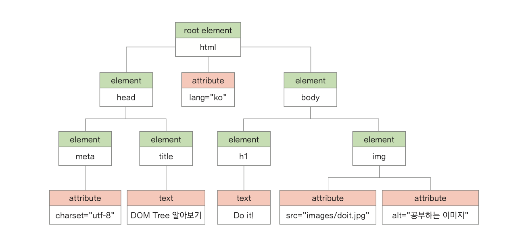

# DOM 문서 객체 모델

* JavaScript를 이용하여 웹 문서에 접근하고 제어할 수 있도록 객체를 사용해 웹 문서를 체계적으로 정리하는 방법
* 웹 문서를 구조화한 DOM tree 와 이벤트 등을 정리해 놓은 표준 [https://dom.spec.whatwg.org/](https://dom.spec.whatwg.org/)
* 웹 문서의 특정 요소에 접근해서 스타일 속성을 조절하거나 JS를 사용해서 동적으로 변화가 생기게 할 수 있다
* ex) 문서 특정위치에 내용표시, 이미지 슬라이드 쇼, 동적인 내비게이션, 모달 박스등 
* 문서에 있는 각 요소를 객체 형태로 처리할 수 있기 때문에 JS를 사용해 웹 문서를 동적으로 다룰 수 있다
* 웹 문서 자체도 객체이고 그 안에 삽입되어있는 이미지와 링크, 텍스트 필드 등도 모두 객체다
* 각 객체마다 속성을 나타내는 property와 동작을 위한 method가 있다
* DOM을 공부하는 것은 각 객체의 특성과 property, method를 알고, 필요할 때마다 property와 method를 적절하게 사용하기 위한 것이다
  
## DOM tree

* 웹 문서에 있는 요소들 간의 부모, 자식 관계를 계층 구조로 표시한 것
* node: DOM tree에서 가지가 갈라져 나간 항목
* root node: DOM tree 의 시작 부분(html)

## DOM을 구성하는 원칙

* 모든 html 태그는 element(요소) 노드
* 웹 문서의 텍스트 내용은 요소 노드의 자식 노드인 text node
* 태그의 속성은 요소 노드의 자식 노드인 attribute node
* 주석은 comment node  
  
  

## 웹 요소에 접근하기

