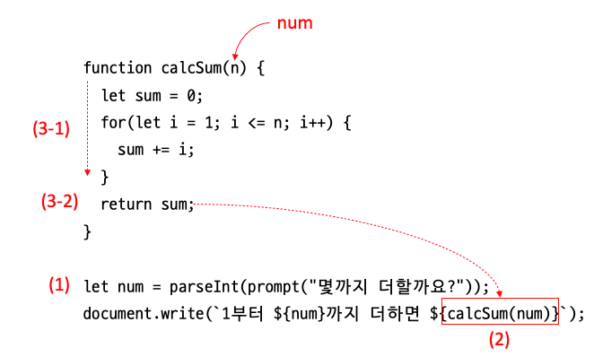

# 함수

* 동작해야 할 목적대로 명령을 묶어 놓은 것
* 각 명령의 시작과 끝을 명확하게 구별할 수 있다
* 묶은 기능에 이름을 붙여서 어디서든 같은 이름으로 명령을 실핼할 수 있다
* JavaScript에는 이미 여러 함수가 만들어져 있어서 가져다 사용할 수 있다
* 함수를 사용하는 이유
  * 프로그래밍에서 가장 중요한 것은 문제를 문석하는 것
  * 주어진 문제를 여러개의 작은 문제로 나눈 후 작은 문제를 하나씩 해결하면서 최종적으로 주어진 문제를 해결한다
  * 가장 작은 단위로 나눈 것을 함수로 작성한다

## 함수 선언 & 실행

* 함수를 선언할 때에는 function이라는 예약어를 사용한다
* 함수 이름을 적은 후 중괄호 안에 실행할 여러 명령들을 묶는다
* 함수를 실행(호출)할 때는 함수 이름 뒤에 중괄호 ( )를 붙인다

```js
function(함수명){
  명령s
}
```

### [실습]1 ~ 10까지 더하는 함수

* html 파일에 연결하고 f12를 눌러서 결과 확인

```js
function cal() {
  let sum=0;
  for(let i = 1; i<=10;i++){
    sum += i;
  }
  console.log(`${sum}`);
}
cal();
```

* 함수 선언 소스는 어디에 넣어도 상관없다
* 하지만 웹 브라우저에서 JS소스를 해석할 때 변수 선언이나 함수 선언 부분을 가장 먼저 해석하기 때문에 보통 함수를 선언하는 소스를 실행 소스보다 앞에 넣는다

## 매개변수, 인수 (통틀어서 '인자'라고도 한다)

* 앞에서 만들었던 cal함수 선언 부분을 살펴보변 for문을 사용해 1 ~ 10까지 더했다
* 같은 방법으로 10이 아닌 다른 수까지 더하려면 함수를 선언할 때 변수를 사용하자
* 매개변수(parameter)
  * 한수를 선언할 때 외부 값을 받는 변수
  * 함수 이름 옆의 괄호 안에 매개변수 이름을 넣어준다
  * 매개변수에서 이름을 붙이는 방법은 일반적인 변수 이름을 붙이는 방법과 같다
  * 매개변수는 선언된 함수에서만 사용한다
  * 함수에 여러 개의 매개변수가 필요할 때는 매개변수 사이에 쉼표(,)를 찍어면서 나열한다
* 인수(argument)
  * 매개변수가 있는 함수를 실행할 때, 매개변수로 넘겨주는 변수

```js
function cal(n) {
  let sum=0;
  for(let i = 1; i<=n;i++){
    sum += i;
  }
  console.log(`${sum}`);
}
cal(15);
```

* `cal(15)` 괄호 안의 숫자만 바꾸면 원하는 합을 구할 수 있다

## return

* 함수 안에서 실행하고 결과까지 처리할 수도 있지만, 함수 바깥에서 실행 결과를 받아 또 다시 처리해야 할 경우도 많다
* 이 경우에는 함수의 실행 결과를 함수를 실행한 시점으로 넘겨주어야 하는데, 이것을 '함수값을 반환한다' 라고 한다
* 함수를 실행한 수 결과를 반환할 때는 예약어 return 다음에 넘겨줄 값이나 변수를 지정한다

```js
function cal(n) {
  let sum=0;
  for(let i = 1; i<=n;i++){
    sum += i;
  }
  return sum;
}
let n = prompt(`숫자를 입력하시오`)
document.write(`합은 ${cal(n)}`)
```



## 기본 매개변수

* 3개의 매개변수가 있는 함수를 실행하면서 인수를 1개나 2개만 지정하면?
* 오류가 발생하지는 않는다. 
* but 값을 전달 받지 못한 매개변수의 값은 undefined가 되어 결과값이 NaN이 된다
* ES6에는 기본 매개변수가 있어서 함수를 정의할 때 매개변수의 기본값을 지정할 수 있다