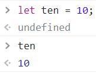
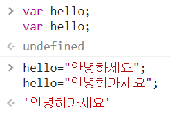
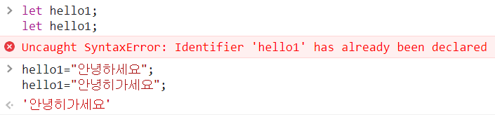
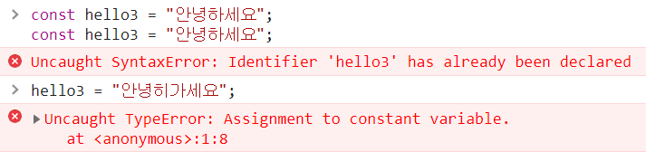

## 변수란? What is Variable

* 변수: 프로그램에서 사용하기 위한 값을 담아놓는 그릇
* 일반적으로 변수는 프로그램 안에서 값이 달라질 수 있는 데이터를 말한다
* 하지만 값이 달라지지 않는 변수도 있다(상수 변수)
* 변수 이름을 지정하는 것은 메모리 공간에 제목과 같다
* 프로그램 안에 사용할 값이 어느 위치에 저장되어 있는지 일일이 신경쓰지 않고 변수 이름만 기억하면 된다
* 변수 이름을 가져와서 값을 사용할 수도, 바뀐값을 저장 할 수도 있다

## 변수 이름 정하는 규칙

* 변수 이름은 숫자로 시작할 수 없고 이름 안에 공백이 있으면 안된다
* JS는 영문자의 대소문자를 구분한다
* 한 단어로 이루어진 변수를 사용할 때에는 주로 소문자
* 두 단어 이상으로 이루어진 변수를 사용할 때에는 (_)로 연결하거나 중간에 대문자를 섞어 가독성을 높인다
* JS에 미리 정해 놓은 예약어는 변수이름으로 사용할 수 없다.ex)let, prompt
* 변수 이름은 내용과 연관성을 가질 수 있도록 한다

## 변수 선언 및 할당

* let 이나 const 다음에 변수 이름을 적어서 변수를 선언한다
  * const은 상수를 위한 예약어, 프로르램안에서 바뀌지 않는 값(상수)
* 변수명 = 값 or 식;
* 변수 선언과 값 할당을 동시에도 가능하다
  * let 변수명 = 값 or 식  
  
  * let 으로 선언한 변수는 재할당이 가능하지만 const으로 선언한 변수는 재할당이 안된다

## 상수 변수가 왜 필요할까

* 지속적으로 사용하고 잦은 변화가 필요없는 경우 한번 상수 변수로 지정해두고 변하지 않게 하여 오류가 없도록 하고 변화가 필요할시 상수변수 선언부분만 수정해준다
* ex) const currentYear = 2022; 로 선언 해두었다가 해가 바뀌면 2022 만 2023으로 바꾸어준다 

## 변수 재선언, 재할당

* 선언은 let hello;
* 할당은 hello = "안녕";
* var은 재선언, 재할당 모두 가능  
  
* let은 재선언x, 재할당만 가능  
  
* const은 재선언,재할당 모두 불가능  
  