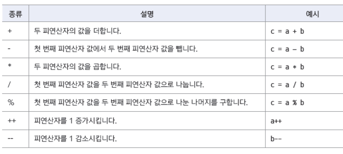
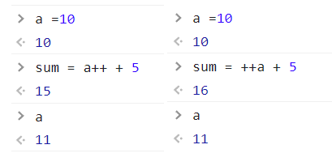
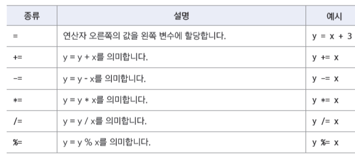
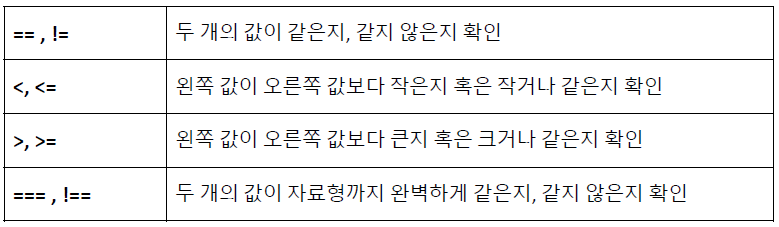
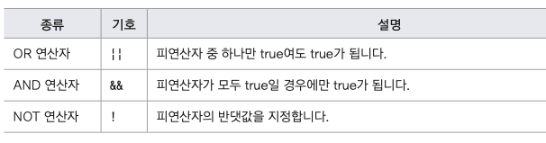
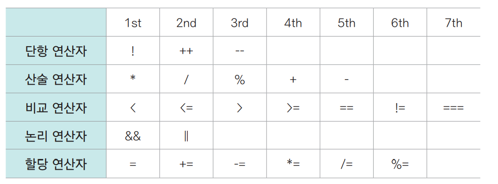

## 연산자(Operator)

* age = currentYear - birthYear + 1
* age,currentYear,birthYear,1은 연상 대상이 되기 때문에 '피연산자' 라고 부른다
* 위 식에서 연산자는 = , - , +

## 산술 연산자  

  

* 증감 연산자가 피연산자 뒤에 있을 때는 연산식의 처리를 끝낸 다음에 적용된다
* 증감 연산자가 피연산자 앞에 있을 때는 연산식을 처리하기 전에 적용된다  
  

## 할당 연산자(대입 연산자)

* 연산자 오른쪽의 실행 결과를 왼쪽 변수에 할당하는 연산자
* 산술 연산자와 할당 연산자를 묶어서 표현한다    
* 

  
## 연결 연산자

* 산술 연산자의 (+)를 연결 연산자로 사용한다
* 문자열과 문자열을 연결하는 연산자

## 비교 연산자

* 피연산자 2개의 값을 비교해서 true나 false로 결과값을 반환한다
* 비교 연산자는 조건을 확인할 때 자주 사용하는 연산자
* 이후 AND,OR 연산자와 함께 사용해서 복잡한 조건도 체크할 수 있다  
  

* 문자열의 비교 
  * 피연산자가 문자열이라면 문자열에 있는 문자들의 ASCII(아스키)값을 비교해서 결정한다
  * ASCII(아스키)
    * 컴퓨터에서 문자를 숫자에 1:1대응한 값을 말한다
    * ex) A의 ASCII값은 65, a의 ASCII값은 97
    * ASCII값을 정리한 표를 ASCII code table이라고 한다
  
## 논리 연산자

* boolean 연산자 라고도 하며 true,false를 처리하는 연산자
* 프로그램에서 조건을 처리할 때 사용하는 연산자  
  

## 연산자 우선순위

* 단항 연산자 -> 산술연산자 -> 비교 연산자 -> 논리 연산자 -> 할당 연산자  
  
  