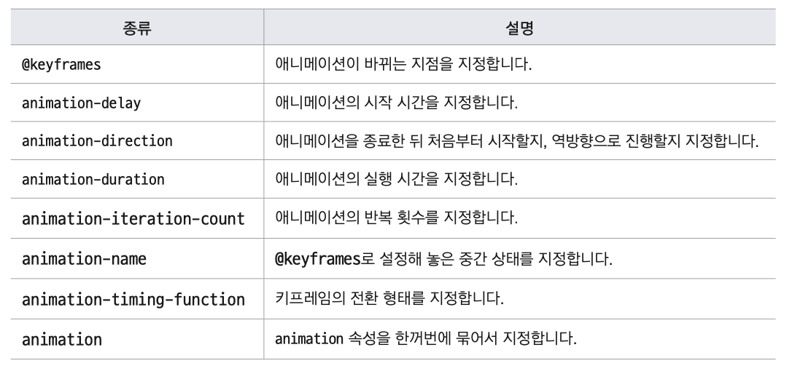
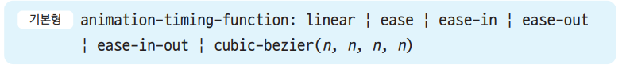
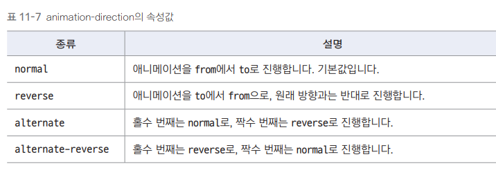
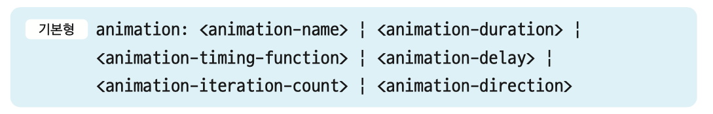

## css animation



## @keyframes

- 애니메이션의 시작과 끝을 비롯해 상태가 바뀌는 지점을 설정
- 기본형

```css
@keyframes <이름>{
  <선택자> {<스타일>}
}
```

- <이름> 으로 키프레임 구별
- @keyframes의 <선택자>에서 속성값이 바뀌는 지점을 가리킴
- 시작 위치는 0%, 끝 위치는 100%로 놓고 위치 지정
- 시작과 끝 위치만 사용한다면 from,to 키워드 사용 가능

```css
@keyframes shape {
  from {
    border: 1px solid transparent; /* 시작 : 1px 투명한 테두리*/
  }
  to {
    border: 1px solid #000; /*끝 : 1px 검은색 테두리, 테두리 둥글게 처리*/
    border-radius: 50%;
  }
}
```

## animation-name, animation-duration

- animation-name
  - 어떤 애니메이션을 사용할지 구별
  - @keyframes 속성에서 만든 애니메이션 이름을 사용
  - 기본형
    animation-name : <keyframes 이름> | none
- animation-duration
  - 애니메이션 실행 시간 설정. 기본값0
  - 사용 가능한 값은 초(s) 나 밀리초(ms)
  - 기본형
    animation-duration:<시간>
- 예)

```css
@keyframes shape{
……
}
@keyframes rotate {
  from {
  transform: rotate(0deg);
  }
  to {
  transform: rotate(45deg);
  }
}
#box2 {
  background-color: #8f06b0;
  border: 1px solid transparent;
  animation-name: rotate;
  animation-duration: 3s;
}
```

## animation-iteration-count

- 애니메이션 반복 횟수 지정
- 기본형
  animation-iteration-count : <숫자> | infinite
- 숫자 : 애니메이션의 반복 횟수
- infinite : 무한 반복

## animation-timing-function

- 애니메이션 시작과 중간 끝에서의 속도 지정



## animation-direction

- 애니메이션은 원래 keyframes에서 정의한 from 에서 to 순서로 진행하는데, animation-direction 속성을 사용해 **진행방향을 바꿀 수 있다**



## animation

- 여러 개의 애니메이션 속성을 하나의 속성으로 줄여서 사용
- 지정하지 않은 속성은 기본 값 사용
- animation-duration 속성 값은 반드시 지정해야 한다(지정하지 않으면 0 이라 못본다)  
  
