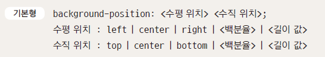
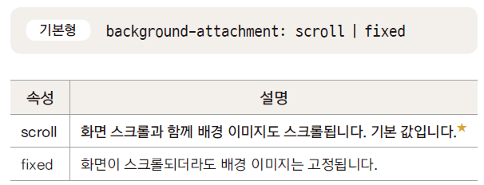
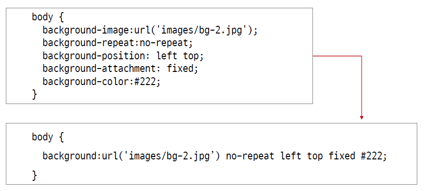
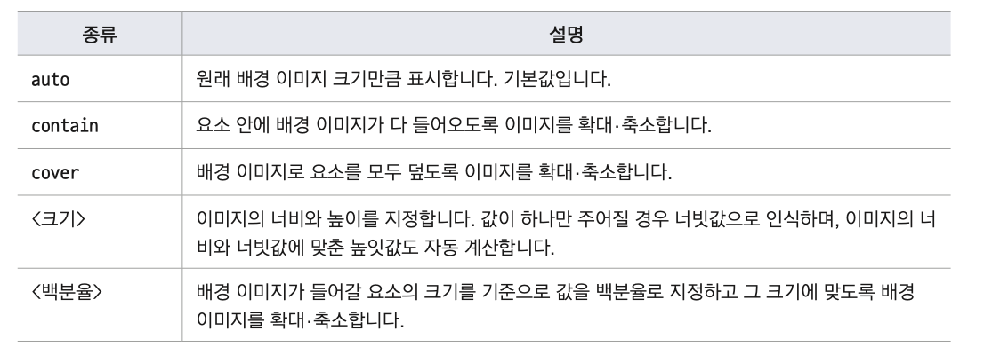

## background-color

- 웹 문서의 요소에 배경색 지정
- 웹 요소의 배경색은 기본적으로 투명(transparent)
- 16진수, rgb/rgba, hsl/hsla 또는 색상이름 사용
- 배경색은 상속 되지 않는다
  - body : 배경색
  - 요소 : transparent(투명)

## background-image

- 배경 이미지 파일 경로 지정
- 화면 크기보다 작은 이미지를 사용하면 화면에 가득차게 반복된다
- 기본형

```css
body {
  background-image: url("image/background.png");
}
```

- 이미지 파일은 .jpg, .gif, .png 사용
- 파일 경로에는 작은 따옴표(' '), 큰 따옴표(" ")를 붙임(따옴표 없이 사용하는 경우도 있음)
- 상대 경로를 지정할 수도 있고 절대 경로를 사용할 수도 있음

## background-repeat

- repeat : 브라우저 화면에 가득 찰 때까지 가로와 세로로 반복한다. 기본값
- repeat-x : 브라우저 화면 너비에 가득 찰 때까지 가로로 반복한다
- repeat-y : 브라우저 화면 높이에 가득 찰 때까지 세로로 반복한다
- no-repeat : 한 번만 표시하고 반복하지 않는다

## background-position

- 배경 이미지를 반복하지 않을 경우, 배경 이미지를 표시할 위치 지정
- 위치를 지정하지 않으면 left,top으로 인식한다

  

- 백분율 : 배경 이미지의 가로 위치와 세로 위치를 %로 나타낸다
  - `background-position : 0% 0%`
- 길이 : 배경 이미지의 위치를 직접 길이로 지정
  - `background-position : 30px 20px;`
  - 요소의 가로 30px, 세로 20px 위치에 배경 이미지의 *왼쪽 모서리*를 맞춘다
- 키워드
  - 가로 배치는 left와 center,top 중에서 선택
  - 세로 배치는 top과 bottom,center 중에서 선택
  - `background-position:center bottom`

## background-position-x, -y

- background-position-x
  - 가로(horizontal)로 위치 지정
  - left,center,right 중에서 선택할 수도 있고, 값을 지정해도 된다
- background-position-y
  - 세로(vertical)로 위치 지정
  - top,center,bottom 중에서 선택할 수도 있고, 값을 지정해도 된다

## background-attachment

- 배경 이미지를 고정할 수 있다

  

## background

- background관련 속성들을 묶어서 한번에 표기 가능  
  

## 불릿 대신 배경 이미지 사용하기

- 목록에 불릿 대신 배경 이미지를 사용할 수 있다
- 배경이기 때문에 목록 위치를 옮기더라도 불릿으로 사용한 배경이미지가 같이 이동한다

```css
<style > ul {
  list-style: none; /*불릿을 없앤다*/
}
li {
  background-image: url("image/icon.png"); /*배경 이미지*/
  background-repeat: no-repeat; /*반복 안함*/
  background-position: left center; /*이미지 위치*/
  padding-left: 50px; /*왼쪽 패딩*/
  line-height: 40px; /*줄 간격*/
}
```

## background-origin

- 배경 이미지를 채울 때 배경 위치 시작점을 정하는 속성
- background-attachment가 fixed일 경우에는 background-origin속성은 무시된다
  - border-box : 배경 이미지의 왼쪽 위 모서리를 테두리의 왼쪽 상단에 배치
  - padding-box : 배경 이미지의 왼쪽 위 모서리를 패딩의 왼쪽 상단에 배치
  - content-box : 배경 이미지의 왼쪽 위 모서리를 내용 영역의 왼쪽 상단애 배치

## background-clip

- 배경색을 채울 때 배경을 어디까지 적용할지 지정하는 속성
  - border-box : 박스 모델의 가장 외곽인 테두리까지 적용한다.기본값
  - padding-box : 박스 모델에서 데투리를 뺀 패딩 범위까지 적용한다
  - content-box : 박스 모델에서 내용(content) 부분에만 적용한다

## background-size

- 배경이미지 크기 조절  
  
