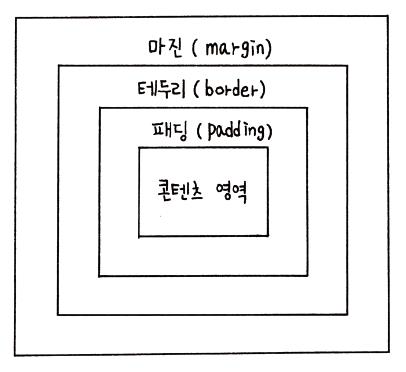
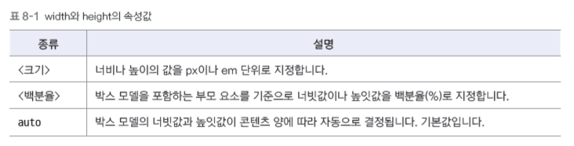
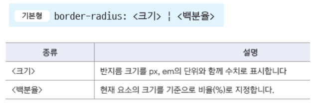
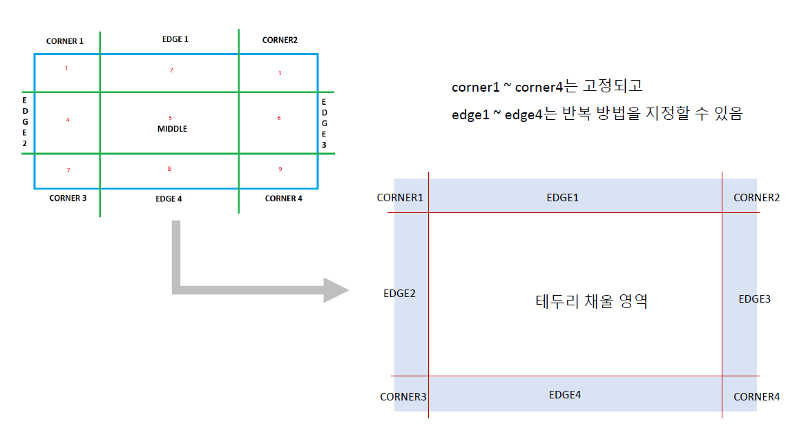
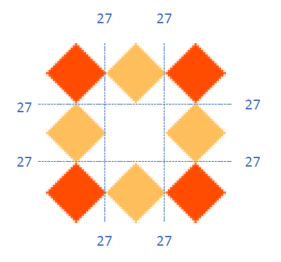
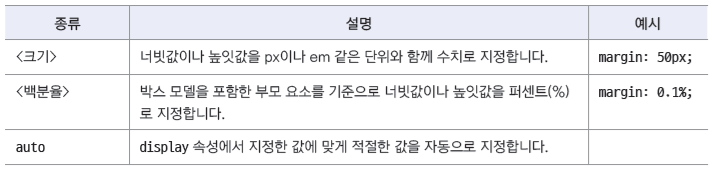
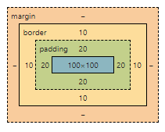
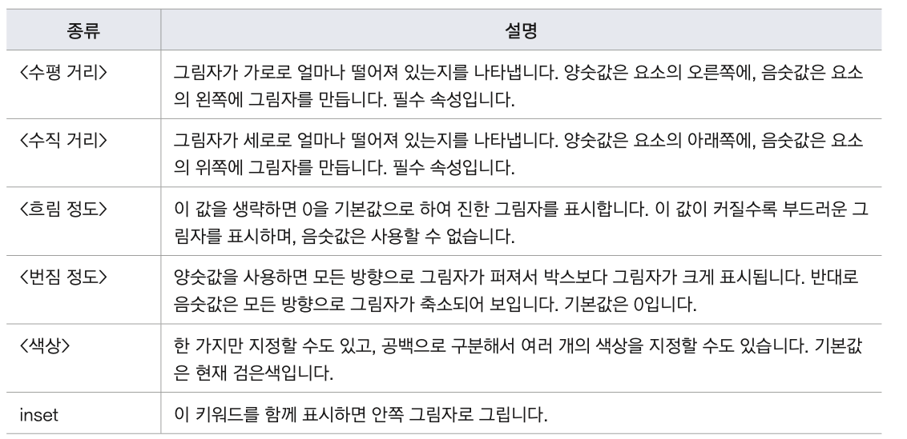

## 레벨 요소

- 블록 레벨 요소

  - 요소를 삽입했을 때 혼자 한 줄을 차지하는 요소
  - 요소의 너비가 100%
  - 예)`<div>`, `<p>`

- 인라인 레벨 요소
  - 줄을 차지하지 않는 요소
  - 화면에 표시되는 콘첸트 만큼만 영역을 차지하고 나머지 공간에는 다른 요소가 올 수 있음
  - 예) ``, `<strong>`

## box model의 기본 구성

  

- 실제 콘텐츠 영역
  - padding : 콘텐츠 영역과 테두리 사이의 여백
  - border : 테두리
  - margin : 요소와 요소 사이의 여백

## width, height

  

```html
<body>
  <div class="box">Box Model</div>
</body>
```

```css
.box {
  width: 400px;
  height: 100px;
}
```

- calc()
  - 계산식을 속성 값으로 사용할 수 있다
  ```css
  .box {
    width: clac(100% - 200px);
  }
  ```

## border-style

- 기본 값이 none 이기 때문에 화면에 테두리가 표시 되지 않는다
- 테두리를 그리기 위해서는 맨 먼저 테두리 스타일 부터 지정한다
- none, hidden : 테두리를그리지않습니다.
- dashed : 사각형으로만든점선
- dottemd : 원으로만든점선
- double : 이중선
- groove : 테두리가파인것처럼그립니다.
- ridge : 테두리가튀어나온것처럼그립니다.
- inset : 요소가파인것처럼그립니다.
- outset : 요소가튀어나온것처럼그립니다.

- border-style 을 사용하면 네 방향의 두께를 한꺼번에 지정
- 네 방향을 따로 지정하려면
  - border-top-style
  - border-right-style
  - border-bottom-style
  - border-left-style
- border-style 만 사용해서 4방향을 지정할 수 있다. (top - right - bottom - left 순으로 적용)

```css
.box {
  border-style: solid dotted dashed double;
  border-style: solid dotted dashed;
  border-style: solid dotted;
  border-style: solid;
}
```

- border-width : box model의 테두리 두께를 지정하는 속성
  - 키워드 : thin, medium, thick 이 있다
- border-color : box model의 테두리 색깔을 지정하는 속성
  - 키워드 : 색상 이름, 값
- border-raduis : box model 의 모서리를 둥글게 처리

  - box model의 꼭짓점 부분에 원이 있다고 가정해서 둥글게 처리한다
  - 네 방향 똑같이 지정  
    

  - 네 방향 다르게도 지정가능

  ```css
  .box {
    border-top-left-radius: 10px;
    border-top-right-radius: 20px;
    border-bottom-left-radius: 30px;
    border-bottom-right-radius: 5px;
  }
  ```

## 테두리에 이미지 넣기


- border-image-source
  - 테두리 스타일 대신 사용할 이미지를 지정한다
  - 값이 지정되지 않았거나 지정한 이미지가 없을 경우 border-style에서 지정한 값대로 테두리가 표시된다
  - 테두리 이미지가 표시되지 않을 것을 고려해서 일반적인 테두리 스타일도 작성 하는게 좋다

    ```css
      .box{
      border: 36px solid orange;
      border-image-source : url('images/border.png');
      }
    ```

- border-image-slice

  - 테두리에 채워 넣은 이미지 원본을 9개의 영역으로 나눈다
  - top, right, bottom, left 모서리를 기준으로 한 offset 거리 값을 지정
  - 네 개의 코너와 네 개의 모서리 그리고 가운데 부분 이렇게 9개의 영역으로 나눈다
    - 가로,세로 81px 삼등분하면 27px 빨간색 모서리는 고정, 주황색 도형은 반복 된다
      
      ```css
      .box {
        border-image-slice: 27; /* 자를 크기 뒤에는 px 붙이지 않는다*/
      }
      ```

- border-image-repeat

  - stretch : 영역을 채울 만큼 이미지를 늘린다. 기본
  - repeat : 영역을 채울 만큼 타일 형식으로 반복합니다. 크기가 맞지 않으면 마지막 이미지가 잘릴 수 있다
  - round : 영역을 채울 만큼 타일 형식으로 반복하되, 이미지의 일부가 잘려질 경우 이미지 크기를 줄여서라도 이미지가 잘리지 않는 상태로 채운다
  - space : 영역을 채울 만큼 타일 형식으로 반복하되, 이미지의 일부가 잘려질 경우 남는 여백만큼 이미지로 채운다

- border-image-width

  - 잘라낸 이미지를 요소에 채워 넣을때의 너비
  - 테주리 너비보다 크게 지정하면 요소의 안쪽 여백과 내용 영역을 침범해서 그려진다
  - 값은 1 ~ 4개 까지 사용가능
  - px 뿐만 나이라 em, % 등 크기와 관련된 다양한 단위를 사용할 수 있음

- border-image-outset
  - 요소 영역의 바깥 부분에 테두리 이미지 표시하기 위해 바깥 테두리 크기 지정
  - px 뿐만 나이라 em, % 등 크기와 관련된 다양한 단위를 사용할 수 있음

## padding

- 콘텐츠와 테두리 사이의 여백
- 네 방향의 padding을 따로 지정할수도 있고
  - padding-top, right, bottom, left
- padding 속성으로 한꺼번에 지정할 수도 있다

  - padding 값이 1 ~ 4개 명 top - right - bottom - left 순으로 적용

    

## margin

- 요소와 요소 사이의 여백
- margin을 이용하면 요소와 요소 간의 간격 조절 가능
- 네 방향의 margin을 따로 지정할수도 있고

  - margin-top, right, bottom, left
  - margin 속성으로 한꺼번에 지정할 수도 있다 - margin 값이 1 ~ 4개 명 top - right - bottom - left 순으로 적용

     

- 사용할 수 있는 값

    

- margin 속성을 사용해 가운데 정렬하기

  - 배치할 요소의 너빗값이 정해져있고
  - margin-left 와 margin-right의 속성값을 auto 로 지정
  - 이렇게 지정하면 css는 웹 브라우저 화면의 너비에서 요소 너빗값을 뺀 나머지 영역을 좌우 마진으로 자동 계산한다

  ```html
  <body>
    <div id="container">
      <h1>하이염</h1>
    </div>
  </body>
  ```

  ```css
  #container {
    width: 600px;
    margin: 20px auto;
  }
  ```

  - margin overlap
    - 요소를 세로로 배치 할 경우에 각 요소의 마진과 마진이 서로 만나면 마진값이 큰 쪽으로 겹쳐진다
    - 생기는 이유 : 여러 요소를 세로로 배치할 때 맨 위의 마진과 맨 아래 마진에 비해 중간에 있는 마진이 지나치게 커지는 것을 방지하기 위한 것
    - 오른쪽 마진과 왼쪽 마진이 만날 경우에는 중첩되지 않는다

## outline

- Value draw line out of box model
- Difference between border and outline
  - Draw line with border : box model includes line
  - Draw line with outline : box model doesn't includes line
- Values you can use
  - outline-style : shape of line(neccesary)
  - outline-color : color of line
  - ourline-width : width
  - outline : shape,color and widht all in one

## box sizing

- 콘텐츠 영역의 너비와 높이, 패딩, 마진 등을 사용해서 웹 요소를 어떻게 배치할지 결정한다
- 웹 요소가 브라우저 화면에서 차지하는 크기를 계산 하려면

  - **width + 좌우 패딩 + 좌우 테두리**를 계산 해야한다
  - 예) 콘텐츠 영역 너비 100px, padding : 20px, 테두리 두께(outline) : 10px 로 한다면 너비는 얼마인가 -> 160(100+40+20)
    
  - 웹 문서에서 텍스트와 이미지 등의 다양한 요소를 배치할 때 매번 계산 하기 힘들기 때문에 속성을 사용한다

    

## css reset

- 브라우저 기본 스타일 : 웹 문서에 css를 사용하지 않더라도 기본적으로 사용하는 스타일
  - 기본 마진,패딩 텍스트 링크에 밑줄 생김, 목록에 불릿 생김 등
- css reset : 브라우저 기본 스타일을 수정하는 소스
- How to reset
  - 전체 선택자(\*)를 사용해 기본적인 속성만 리셋한다
  - 태그별로 기본 속성 값을 리셋 한다
  - css를 리셋 하는 소스를 검색해서 복사해서 사용한다

## box-shadow

- box model에 그림자 효과를 주는 속성 : 포토샵 없이도 그림자 효과 가능하다
  - 기본형
  ```css
  .box {
    box-shadow: 수평거리 수직거리 흐림정도 번짐정도 색상 inset;
  }
  ```
  
