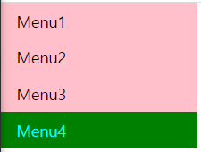
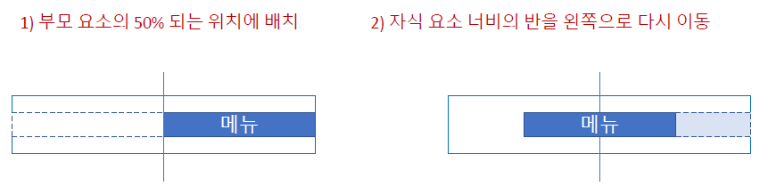
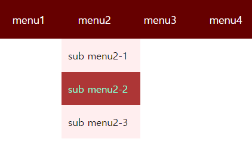
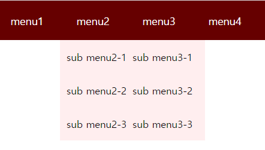
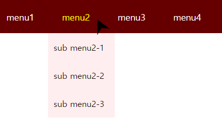

# css를 활용하여 다양한 내비게이션(메뉴) 만들어보기

## 세로 내비게이션

- 아래와 같은 내비게이션 만들어보기  
     
  
  - ul 조건
    1. 불릿을 없애고
    2. padding, margin 0
    3. width 200px
    4. background:pink
  - link 조건
    1. 글자색 black
    2. padding 8px 16px
    3. link text underline 없애기
    4. 첫 글자만 대문자
  - link hover 조건
    1. 배경색 green
    2. 글자색 aqua         
    
  ```html
  <body>
  <nav>
    <ul>
      <li><a href="#">menu1</a></li>
      <li><a href="#">menu2</a></li>
      <li><a href="#">menu3</a></li>
      <li><a href="#">menu4</a></li>
    </ul>
  </nav>
  </body>
  ```

  ```css
  * {
  margin:0;
  padding:0;
  box-sizing:border-box;
  }
  nav ul{
    list-style: none;
    padding: 0;
    margin: 0;
    width: 200px;
    background: pink;
  }
  nav li a{
    display: block;
    color: black;
    padding: 8px 16px;
    text-decoration: none;
    text-transform: capitalize;
  }
  nav li a:hover{
    background: green;
    color: aqua;
  }
  ```

## 가로 내비게이션

- 아래와 같은 내비게이션 만들어보기   
  

  - ul condition
    1. 내비게이션이 화면 너비를 가득 채우도록 width 100%
    2. height 50px
    3. background #444
    4. margin 0
  - li condition 
    1. display : inline-block
  - link(a) condition 
    1. display : block
    2. 글자색 #fff
    3. padding 14px 26px
    4. Capitalize first letter
    5. 글자는 중앙 정렬
    6. 마우스 오버 했을때 배경색 트랜지션 0.4초 지정
  - 마우스 오버 했을때 배경색 pink, 글자색 black으로 바뀌게 지정  
  
  ```html
  <nav>
    <ul>
      <li><a href="#">menu1</a></li>
      <li><a href="#">menu2</a></li>
      <li><a href="#">menu3</a></li>
      <li><a href="#">menu4</a></li>
    </ul>
  </nav>
  ```

  ```css
  /* Navigation */
  ul {
  list-style: none;
  }
  a {
    text-decoration: none;
  }
  nav{
    width: 100%;
    height: 50px;
    background-color: #444;
    margin: 0;
  }
  nav ul li{
    display: inline-block;
  }
  nav ul a{
    display: block;
    color: #fff;
    padding: 14px 26px;
    text-transform: capitalize;
    text-align: center;
    text-decoration: none;
    transition: background 0.4s;
  }
  nav ul li:hover{
    background-color: pink;
  }
  nav ul li a:hover{
    color:black;
  }
  ```

## 가로 내비게이션 flexbox 사용해서 가운데 배치  

  ```css
  /* Navigation */
  nav{
   ...
    display: flex;
    justify-content: center;
    align-items: center;
  }
  nav ul{
    width: 500px;
    display: flex;
    justify-content: space-between;
  ```

  - width 값이 정해져 있다면 margin-left와 margin-right을 auto로 지정해서 화면 중앙에 배치할 수 있다. 하지만 width 값을 모른다면  
      
  
  ```css
  nav{
    ...
    position:relative;
  }
  nav ul{
    position:absolute;
    left:50%;
    transform: translateX(-50%);
  }
  ```

## 내비게이션 고정하기

- 내비게이션을 위쪽(top)에 고정해서 scroll down 해도 메뉴가 고정되어 있다

```css
nav{
  ...
  position:fixed;
  top:0;
}
```

## 서브 메뉴가 있는 내비게이션   

    

- 기본 html 소스
 
```html
  <nav>
    <ul>
      <li><a href="#">menu1</a></li>
      <li>
        <a href="#">menu2</a>
        <ul>
          <li><a href="#">sub menu2-1</a></li>
          <li><a href="#">sub menu2-2</a></li>
          <li><a href="#">sub menu2-3</a></li>
        </ul>
      </li>
      <li>
        <a href="#">menu3</a>
        <ul>
          <li><a href="#">sub menu3-1</a></li>
          <li><a href="#">sub menu3-2</a></li>
          <li><a href="#">sub menu3-3</a></li>
        </ul>
      </li>
      <li><a href="#">menu4</a></li>
    </ul>
  </nav>
```
  

  
  
- 메인 메뉴 
  - nav
    - width:100%, flex 이용해서 center, 배경색 #600
  - nav > ul
    - height: 60px
  - nav > ul > li
    - 왼쪽으로 플로팅, 줄간격 50px
  - nav > ul > li > a
    - display: block, padding: 5px 25px, 글자색: #fff, 글자 굵기:500
  - 글자 hover:글자색 yellow
  - 글자 배경색 hover: #ad3636
  
```css
/*메인 메뉴*/
nav{
  width: 100%;
  display: flex;
  justify-content: center;
  background-color: #600;
}
nav > ul{
  height: 60px;
}
nav >ul >li{
  float: left;
  line-height: 50px;
  position: relative;
}
nav > ul >li>a {
  display: block;
  padding: 5px 25px;
  color: #fff;
  font-weight: 500;
}
nav> ul>li>a:hover{
  color: yellow;
}
nav>ul>li>ul>li:hover{
  background-color: #ad3636;
}
```

- 서브 메뉴 스타일
  - 서브 메뉴 영역(nav > ul > li > ul)
    - position:absolute, width:120px,height:auto, background-color: #ffeeef
  - 서브 메뉴 링크(nav > ul > li > ul > a)
    - 글자 굵기:500, 글자 크기:15px, padding:10px,글자색:black
  - 서브 메뉴 항목 위로 마우스(nav > ul > li > ul > li:hover)
    - 배경색 : #ad3636;
  - 서브 메뉴 항목 위로 마우스(nav > ul > li > ul > li:hover a)
    - 글자색 : aquamarine

```css
/*서브 메뉴*/
nav>ul>li>ul{
  position: absolute;
  width: 120px;
  height: auto;
  background-color: #ffeeef;
}
nav>ul>li>ul a{ 
  font-size:15px;
  font-weight: 500;
  padding: 10px;
  color: black;
}
nav>ul>li>ul>li:hover{
  background-color: #ad3636;
}
nav>ul>li>ul>li:hover a{
  color: aquamarine;
}
```

  

- 서브 메뉴 감췄다가 표시하기
  - 서브 메뉴 영역(nav > ul > li > ul)
    - display 속성 사용해서 감추기
  - 서브 메뉴 표시하려면 
    - 메인 메뉴 항목 위로 마우스 올렸을때(display 속성 사용해서 표시)

```css
nav>ul>li>ul{
  ...
  display:none;
}
nav>ul>li:hover>ul{
  display:block;
}
```