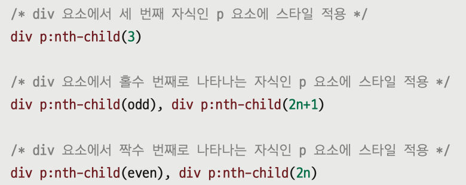

## 연결 선택자

- 선택자와 선택자를 연결해 적용 대상을 제한하는 선택자
- combination selector 또는 조합 선택자 라고 한다
- 문서의 포함 관계에 따라 선택자를 사용한다
- 하위 선택자, 자식 선택자, 형제 선택자, 인접 형제 선택자
  - 요소 간의 포함 관계를 활용해 원하는 요소를 찾아갈 수 있도록 하는 방법

## 하위 선택자(descendant selector)

- 자손 선택자, 후손 선택자라고 부른다
- 특정 선택자를 기준으로 그 선택자의 **모든 하위요소**에 스타일이 적용된다
- 자식요소 뿐만 아니라 손자요소, 손자의 손자요소 등 모든 하위요소에 적용
- 하위 선택자를 정의할 때는 상위요소와 하위 요소를 나란히 쓴다
- {...} section요소 안의 모든 p 요소에 적용할 스타일 규칙  
   


## 자식 선택자(child selector)

- 특정 요소의 자식 요소에만 스타일을 적용하는 선택자
- 두 요소 사이에 부등호(>)를 표시해 부모 요소와 자식 요소를 구분
- {...} section요소 안에 포함된 p 요소 중 자식 p 요소에만 적용할 스타일 규칙  
 
  

## 형제 선택자

- 요소1과 요소2의 부모 요소가 같아야 한다(그래서 형제)
- 요소1을 기준으로 다음에 오는 모든 요소2에 스타일 적용
- 요소1과 요소2 사이에 기호 ~ 사용
- h1 요소 다음에 오는 모든 형제 p요소의 글자색을 바꾼다  

  

## 인접 형제 선택자

- 같은 부모를 가진 형제 요소 중 첫 번째 동생 요소에만 스타일 적용
- 형제 선택자 : 모든 형제 요소에 다 적용
- 인접 형제 선택자 : 현재 요소 다음에 오는 형제 요소 중 첫번째
- 요소1과 요소2 사이에 + 기호 사용
- 요소1과 요소2 는 같은 레벨이면서 요소1 이후 첫번째 요소2에 적용
- h1 요소 다음에 오는 p 요소들 중 첫번째 p요소에만 파란색 글씨 적용  

  

## 속성 선택자

- 웹 요소의 속성(attribute)을 사용해서 선택할 수 있게 하는 선택자
- 태그 안에 여러가지 속성을 사용하게 되는데, 그 속성과 속성 값을 활용합니다
- 지금까지는 태그나 class, id 값을 함께 연결해서 선택자를 만들었다면 이제부터는 속성과 속성 값을 연결해서 선택자를 만든다
- [ ] 안에 지정한 속성이 있는 요소를 찾아 스타일 적용
- 예) 요소 중 readonly 속성이 있는 요소를 찾아서 적용한다

```css
input[readonly] {
  background-color: black;
}
```

## [속성 = 값] 선택자

- 주어진 속성과 속성 값이 일치하는 요소를 찾아 스타일 적용
- 예) input 요소 중에서 텍스트 필드와 비밀번호 필드의 너비와 높잇값을 지정한다

```css
input[type="text"],
input[type="password"] {
  width: 300px;
  height: 30px;
}
```

## [속성 ~= 값] 선택자

- 여러 속성 값 중에 해당 값이 포함되어 있는 요소를 찾아 스타일 적용
- **값이 한 단어** 여야 한다
- id 속성에 user 값이 있는 요소를 찾는다(user-1은 선택 안된다)

```css
input[id~="user"] {
  background-color: red;
}
```

## [속성 |= 값] 선택자

- 특정 값이 포함된 속성을 가진 요소를 찾아 스타일 적용
- 하이픈으로 연결해 한 단어 값을 이루는 요소도 선택
- id 속성에 user 값이 있는 요소를 찾는다(user-1, user-2도 선택)

```css
input[id|="user"] {
  background-color: red;
}
```

## [속성 ^= 값] 선택자

- 특정 값으로 시작하는 속성을 가진 요소를 찾아 스타일 적용
- 단어가 아니라 값의 일부만 지정해도 된다
- id 속성이 pwd로 시작하는 요소를 찾는 방법

```css
input[id^="pwd"] {
  background-color: red;
}
```

## [속성 $= 값] 선택자

- 특정 값으로 끝나는 속성을 가진 요소를 찾아 스타일 적용
- 링크의 href 속성이 .gif로 시작하는 요소를 찾는 방법

```css
a[href^=".gif"] {
  background-color: red;
}
```

## 가상 선택자(pseudo selector)

- 웹 문서 소스에는 존재하지 않지만 필요에 따라 가상의 선택자를 만든다
- 가상 클래스 선택자 : 콜론(:) 뒤에 선택자 이름 붙인다
- 가상 요소 : 태그 없이 임시 요소를 만든다
- 사용자의 동작에 따라 지정하는 가상 클래스 선택자
  - :link : 방문하지 않은 링크에 스타일 적용
  - :visited : 방문한 링크에 스타일 적용
  - :active : 웹 요소를 활성화 했을 때의 스타일 적용
  - :hover : 웹 요소에 마우스 커서를 올려놓을때의 스타일 적용
  - :focus : 웹 요소에 초점이 맞춰졌을떄의 스타일 적용
  - **순서 중요** :link -> :visited -> :hover -> :active
  - LoVe and HAte

## 요소 상태에 따른 pseduo class selctor

- :target : 앵커로 연결된 부분에 스타일 적용
- :enabled,:disabled : 요소의 사용 여부에 따라 스타일 적용
- :checked : radio button 이나 check box에 체크 했을때 스타일 적용
  - radio buttion 이나 check box를 클릭했을때 연결된 레이블의 글자색을 바꾸려면 : 선택된 항목에 checked 속성이 추가 된다는것을 응용하자
- :not : 특정 요소를 제외하고 스타일 적용

## 문서 구조에 다른 가상 클래스 선택자

- 웹 문서의 구조를 기준으로 특정 위치에 있는 요소를 찾아 스타일 적용


- 수식을 사용해 위치 정하기
  - 스타일을 적용할 위치가 1,3,5, 처럼 바뀐다면 반복된 규칙을 찾아서 an+b 처럼 수식 사용가능(n=0부터 시작)    
  

## css 변수

- 최신 브라우저에서는 css 변수를 사용할 수 있다
- css속성 값을 미리 변수에 정의해 놓고 사용하는 방법
- 사이트를 만들 때 자주 사용하는 색상이나 글자 크기 등을 미리 변수로 정의 한다
  - 매번 값을 따로 지정하지 않고 변수 하나로 처리 가능하다
  ```css
  :root {
    --bg-color: #eee;
  }
  body {
    background-color: var(--bg-color);
  }
  button {
    background-color: var(--bg-color);
  }
  ```
