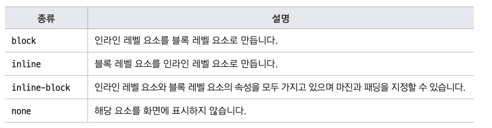
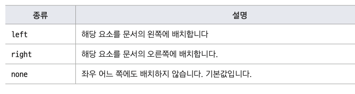
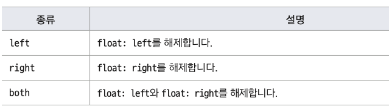
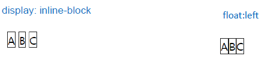
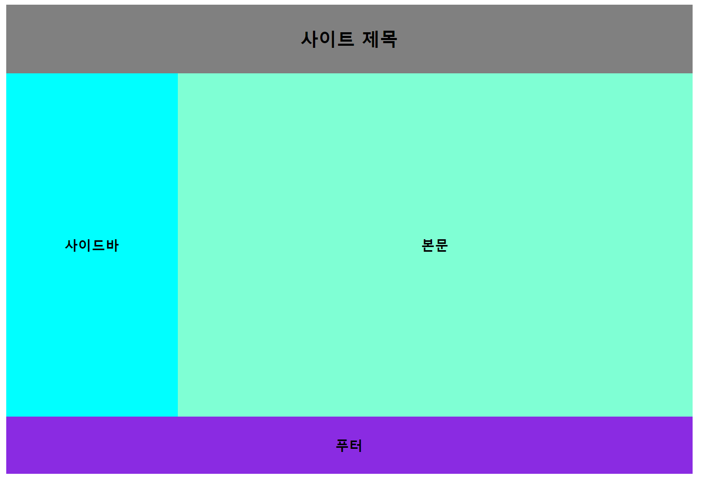
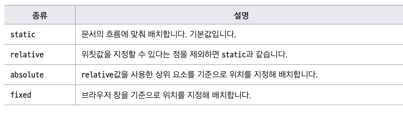
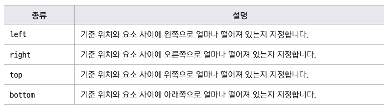
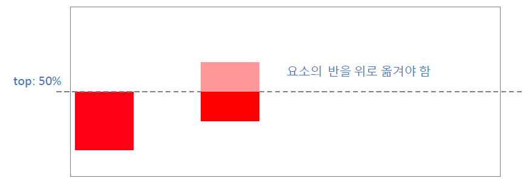

## display 속성

- 요소의 배치 방법을 결정하는 속성
- 속성 값이 아주 많다
  

  ```css
  div {
    display: inline;
    display: inline-blick;
    /*
    width:200px;
    height:100px;
  */
  }
  ```

  - display:inline 과 inline-block 은 화면 상에 비슷하게 보일 수도 있지만 실제로 가지고 있는 특성이 다르기 때문에
    웹 문서 안에서 layout을 잡아야 할 때 큰 차이가 납니다. 인라인으로 배치하면서 크기나 패딩 값을 사용하겠다면
    display:inline-block으로 지정해야 합니다.

- display : none

  - 요소를 화면에서 감출 때 사용한다
  - visibility : hidden 과 차이는 hidden은 공간은 놔두고 보이지만 않게 하지만 none은 공간 자체가 없어짐

  ## float

  - 텍스트 단락의 왼쪽이나 오른쪽에 이미지를 배치하려고 할 때 사용하는 속성
  - 텍스트 단락 왼쪽이나 오른쪽에 이미지가 떠 있게 만든다  
    

  ```html
  <style>
    img {
      float: left; /* 왼쪽에 떠 있게 */
      margin-right: 40px;
    }
  </style>
  ```

## clear

- float 속성을 사용해 웹의 요소를 왼쪽이나 오른쪽에 배치하면 그 다음에 오는 요소에도 똑같은 속성이 전달됩니다.
- float 속성의 영향을 받지 않으려면 clear 속성을 사용해서 플로팅을 해제해야 합니다.  
  

## How to aline Menu horizontally

1. float : left
2. display : inline-block

- Apply padding, margin on `<li>` and set size
- Apply block on `<a>` and apply padding, margin

- float : left 와 display : inline 차이점
  - display : inline-block 과 float:left 모두 요소를 가로로 배치하는 것은 같다
  - 차이점
    - display:inline-block은 가로로 배치하면서도 기본 마진을 가지고 있다.
    - float:left로 배치하면 가로로 배치될 때 요소에 기본 마진이 없다
    - float:left를 사용하면 clear 속성으로 플로팅을 해제해야한다  
      

## 2단 layout

- float속성과 clear속성을 사용하면 웹 문서의 layout을 만들때도 활용 할 수 있다.  
   

  - html

  ```html
      <link rel="stylesheet" href="test.css">
  </head>
  <body>
    <div id="container">
        <header>
            <h1>사이트 제목</h1>
        </header>
        <aside>
            <h2>사이드바</h2>
        </aside>
        <section id="content">
            <h2>본문</h2>
        </section>
        <footer>
            <h2>푸터</h2>
        </footer>
    </div>
  </body>
  ```

  - CSS

  ```css
  * {
    margin: 0;
    padding: 0;
    box-sizing: border-box;
  }
  #container {
    width: 1200px; /*내용 전체의 너비*/
    margin: 20px auto; /*내용을 화면 가운데*/
  }
  header {
    width: 100% /*부모요소의 너비와 똑같게*/;
    height: 120px; /*header 높이*/
    background-color: gray;
  }
  h1 {
    text-align: center;
    line-height: 120px;
  }
  aside {
    width: 300px;
    height: 600px;
    background-color: aqua;
    float: left;
  }
  #content {
    width: 900px;
    height: 600px;
    background-color: aquamarine;
    float: left;
  }
  aside h2,
  #content h2 {
    text-align: center;
    line-height: 600px;
  }
  footer {
    width: 100%;
    height: 100px;
    background-color: blueviolet;
    clear: left;
  }
  footer h2 {
    text-align: center;
    line-height: 100px;
  }
  ```

## Setting position of web

- position : 텍스트나 이미지 등 웹 요소를 원하는 위치에 표시할 수 있습니다  
  

- relative, absolute, fixed : left, right, top, bottom 속성을 사용해 위치를 지정

  
- relative : 이전 요소와 자연스럽게 연결
- absolute, fixed : 특정 위치에 표시

- position속성 중에서 absolute 값을 사용할 때는 주의해야 한다
- 요소에 position:absolute 라고 한 후 위칫값을 지정하면 요소 중에서 position:relative를 사용한 요소를 기준으로 위치 결정
- 부모 요소 중에 없으면 상위 요소를 찾아보고, 그래도 없다면 더 위의 요소를 찾아 본다
  - 어떤 요소에 position : absolute 를 사용하려면 부모 요소에 position:relative라고 지정해야 한다

## 웹 요소 정중앙에 표시하기

- 텍스트를 가로로 중앙에 표시하는 방법
  - 텍스트의 text-align속성을 center로 지정
- 웹 요소를 가로로 중앙에 표시하는 방법
  - 요소의 왼쪽 마진과 오른쪽 마진을 auto로 지정
- 웹 요소를 세로로 중앙에 표시하는 방법
- position:absolute 와 top:50%를 사용(요소 크기의 50%만큼 반대 방향으로 이동)



- 참고

  - 세로로만 중앙 배치

  ```css
  .box {
    position: absolute;
    top: 50%;
    transform: translateY(-50%);
  }
  ```

  - 가로로만 중앙 배치

  ```css
  .box {
    position: absolute;
    left: 50%;
    transform: translateX(-50%);
  }
  ```
