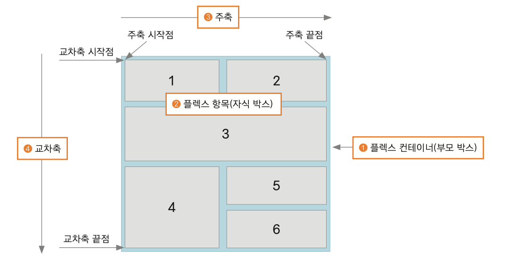
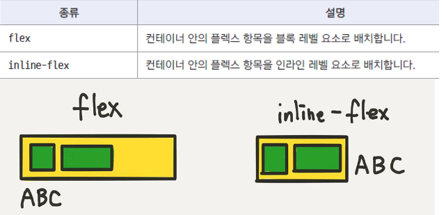
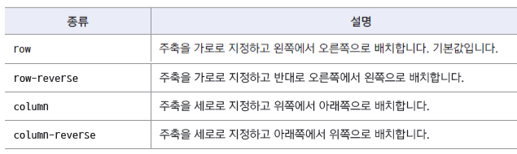
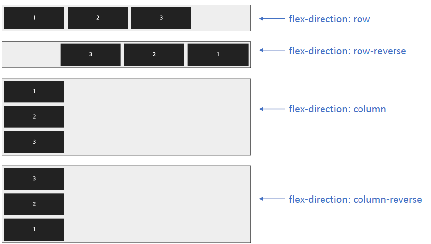
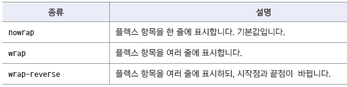
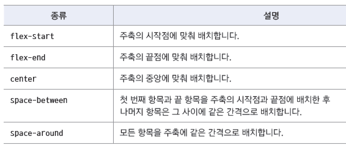
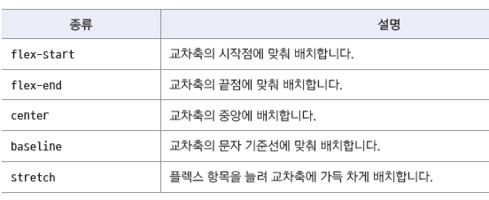
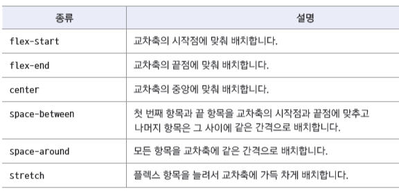

## Flexbox

- grid layout을 기본으로 하고 각 박스를 원하는 위치에 따라 배치
- 수평 방향이나 수직 방향 중에서 한쪽을 주축으로 정하고 박스를 배치
- 화면 너비를 넘어가면 교차축으로 넘어가서 배치
  
- To use flexbox layout

  - 적용할 대상을 flex container로 지정하고
  - flex container 안에 배치할 요소를 넣는다
  - 주축을 결정하고
  - 주축의 정렬 방법과 교차축의 정렬 방법을 지정한다

## display

- 배치할 요소들을 감싸는 부모요소를 flex container로 지정  
  

## flex-direction

- flex 항목 배치를 위한 주축과 방향을 지정한다  
   
  - 아래와 같은 container를 4개 만든다
  ```html
  <div class="container">
    <div class="box"><p>1</p></div>
    <div class="box"><p>2</p></div>
    <div class="box"><p>3</p></div>
  </div>
  ```
  - style에 flex를 지정하고
  ```html
  <style>
    .container {
    width:700px;
    display:flex; /* 플렉스 컨테이너 지정*/
    background
    color:#eee;
    border:1px solid #222;
    margin
    bottom:30px;
    }
  </style>
  ```
  - 개별 id를 지정해서 flex-direction을 각각 배정한다
  ```html
  <div class="“container”" id="“opt1”">…</div>
  <div class="“container”" id="“opt2”">…</div>
  <div class="“container”" id="“opt3”">…</div>
  <div class="“container”" id="“opt4”">…</div>
  ```
  ```css
  #opt1 {
    flex-direction: row; /* 왼쪽에서 오른쪽으로*/
  }
  #opt2 {
    flex-direction: row reverse; /* 오른쪽에서 왼쪽으로*/
  }
  #opt3 {
    flex-direction: column; /* 위에서 아래로*/
  }
  #opt4 {
    flex-direction: column reverse; /* 아래에서 위로*/
  }
  ```
  

## flex-wrap

- flex 항목을 한 줄에 다 표시할지, 여러 줄에 걸쳐 표시할지 지정  
  

## flex-flow

- flex-direction 속성 과 flex-wrap 속성을 하나의 속성으로 줄여서 표현
- 기본값은 flex-flow : row nowrap

## justify-content

- flex 항목을 주축 방향을 배치할 때의 배치 기준  

  

## flex 항목에서 margin 활용하기

- flex 항목에서 margin 값을 auto로 지정하면 flex 항목을 쉽게 배치할 수 있다
- 주축으로 한 줄 배치했을 때 활용하면 좋다
- flex-direction:row 일때

  - margin-right: auto;
    - margin이 오른쪽 모든 공간 차지. flex 항목을 왼쪽 끝으로 보낼 수 있다
  - margin-left: auto;
    - margin이 왼쪽 모든 공간 차지. flex 항목을 오른쪽 끝으로 보낼 수 있다
  - margin-left: auto; magin-right:auto;
    - margin이 왼쪽과 오른쪽 공간을 반반 차지. flex 항목을 중앙에 배치할 수 있다

- flex-direction:column 일때
  - margin-bottom: auto;
    - margin이 아래쪽 모든 공간 차지. flex 항목을 위쪽 끝으로 보낼 수 있다
  - margin-top: auto;
    - margin이 위쪽 모든 공간 차지. flex 항목을 아래쪽 끝으로 보낼 수 있다
  - margin-top: auto; magin-bottom:auto;
    - margin이 위쪽과 아래쪽 공간을 반반 차지. flex 항목을 중앙에 배치할 수 있다

## align-items

- 교차축이 한 줄 일경우 교차축의 배치 방법 조절  
  

## align-self

- 교차축에서 특정 항목만 선택해서 배치하려고 할 때  
  

## align-content

- flex-wrap:wrap을 사용해서 flex항목이 여러 줄로 표시될 때 교차 축의 배치방법 지정  
  

## gap

- css grid layout에서 사용하던 속성이지만 flexbox에서도 사용 가능해졌다
- flex container 안에 있는 flex 항목들간의 여백 조절
  - 값이 하나라면 : 좌우, 상하 여백
  - 값이 2개라면 : 첫번째 값은 상하 여백, 두번째 값을 좌우 여백

## flexible flexbox

- flexbox를 사용해 layout을 만들면 flexible하다
  - 화면 크기가 달라지면 거기에 맞춰서 flex항목이 늘어나거나 줄어든다
- flex-basis : flex 항목의 기준 크기
- flex-grow : 남은 여백을 채우기 위해 flex항목을 늘인다
- flex-shrink : 지정한 영역을 벗어날 경우 flex항목을 줄인다
- flex : flex-grow와 flex-shrink,flex-basis를 묶어서 표현한다

## flex-basis

- flex 항목의 기본 크기 설정
- flex-direction이 row 라면 width, column이라면 height을 정한다
- 기본 값 auto(콘텐츠 영역만큼 크기를 차지한다)
- px, %, em, rem 등 width 에서 사용할 수 있는 모든 단위를 사용할 수 있다

## flex-basis vs width

- flex-basis : 150px, width : 150px 가 같아 보인다
  - flex 방향이 바뀔 경우 flex-basis는 높이값이 된다
  - 지정한 크기(150px)보다 더 큰 내용이 들어올 경우,
    - flex-basis는 내용에 맞게 영역이 넓어진다
    - width는 끝까지 지정한 크기만큼만 표시된다
  - flex-basis는 width보다 유연하고, width는 강제로 적용된다

## flex-grow

- flex항목을 배치하고도 flex container에 여백이 남을 때 flex항목 확대하기
- 기본값: 0(확대하지 않는다)
- 음수 값은 설정할 수 없다

## flex-shrink

- flex항목을 배치할 때 flex container 공간이 부족할 경우 flex항목 축소
- flex-wrap:wrap일 경우에는 적용되지 않는다(wrap-공간이 부족하면 다음줄로 넘겨버리기 때문이다)
- 기본값 : 1
- flex-shrink : 0 container크기가 flex항목보다 작아져도 flex항목을 축소하지 않는다
- flex-shrink : 1 container크기가 flex항목보다 작아지면 container에 맞춰 축소한다

## flex

- flex-grow와 flex-shrink,flex-basis를 한꺼번에 지정한다
- 기본flex : 0 1 auto
- 숫자는 flex-grow와 flex-shrink. 단위가 있는 값은 flex-basis
- 3개의 값을 모두 지정할 때는 순서를 지켜야 한다. flex-grow flex-shrink flex-basis
- **flex : 숫자** 의 의미
  - flex에 숫자 하나만 지정되면 flex-grow 값 + flex-shrink:1, flex-basis:0 즉, 기본값 사용
  - flex에 숫자가 두개이면, 첫번째 값은 flex-grow, 두번째 값에 단위가 없으면 flex-shrink, 있으면flex-basis
- flex: none, flex: auto
  - flex: none
    - flex 항목의 크기가 width,height에 의해 결정 된다
    - container크기에 관계없이 항상 일정한 크기를 유지한다
    - flex:0 0 auto 와 같다
  - flex: auto
    - flex 항목의 크기가 width,height에 의해 결정 된다
    - container크기에 따라 flex항목의 크기가 늘어나거나 줄어들 수 있다
    - flex: 1 1 auto와 같다
