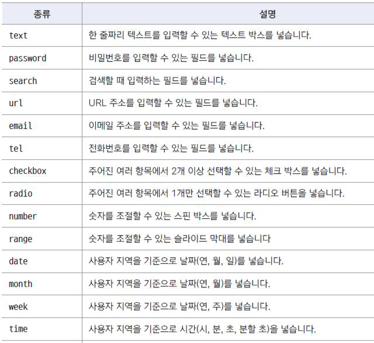
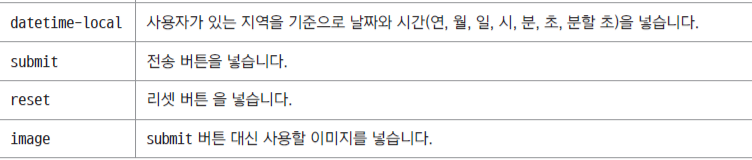
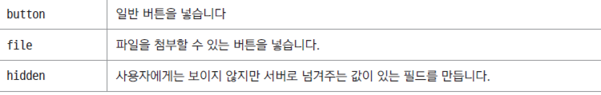
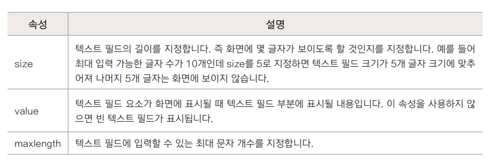

## 폼 삽입하기
- `<form>` 태그
  * 폼 전체를 감싸는 기본 태그
  * `<form>,</form>` 사이에 여러 폼 요소 삽입(텍스트필드, 체크박스,버튼 등 역할마다 다른소스 사용)
- 기본형
```html
<form[속성="속성값"]> 여러 폼 요소 </form>
```

## 폼에서 구역 나누기
- `<fieldset>` 태그
  * 폼 요소를 그룹으로 묶는 태그
  * 필수적인 것 아님, 폼 안의 내용을 그룹으로 묶으려고 할 때 사용
  * 기본형 
   ```html
  <fieldset[속성="속성값"]> ~~ </fieldset>
   ```

- `<legend>` 태그
  * 그룹으로 묶는 구역에 제목을 붙이는 태그 제목을 생략할 수도 있다
  * 기본형
  ```html
  <fieldset>
    <legend> 그룹 이름 </legend>
  </fieldset>
  ```
  
  - 참고 : 필드셋 테두리 없애기 
  ```html
  <style>
    fieldset{border : none;}
    legend{display : none;}
  </style>
  ```
## `<input>` 태그
  - 한 줄짜리 사용자 입력을 받는 태그 & 버튼을 만드는 태그
  - type 속성에 따라 폼 요소가 달라짐
  - type 속성 값에 따라 함께 사용할 수 있는 속성도 달라짐
  ```html
  <input type="유형" [속성="값"]>
  ```
  
  
  
  
  - 텍스트 필드
  - type = "text"
    * 한 줄짜리 텍스트 입력 필드
    * 주로 아이디나 이름, 주소 등 텍스트 입력
    * 기본형
    ```html
    <input type = "text"[속성]>
    ```
    
  - 패드워드 필드
  - type = "password"
    * 비밀전호 입력
    * 사용자가 입력하는 내용이 ＊ , ●  로 표시된다
    * 기본형
    ```html
    <input type = "password"[속성]>
    ```
예시)
```html
<body>
  <form>
    <fieldset>
      <legend>로그인</legend>
        <ul>
          <li>
            아이디 <input type="text">
          </li>
          <li>
            비밀번호 <input type="password">
          </li>
        </ul>
      </fieldset>
    </form>
</body>
```


## `<label>` 태그
- `<input>` 태그와 같은 폼 요소에 레이블(텍스트)를 붙일 떄 사용
- 레이블과 입력 폼을 연결해 줌
- 웹 표준을 위해 반드시 사용해야 한다. 마크업 하고 CSS를 사용해 화면에서 감출 수 있음
- 방법 1
  * 전체를 감싼다
  ```html
  <label>아이디 <input type=＂text＂></label>
  ```
- 방법 2
  * for 속성과 id 속성을 사용한다  
  ```html
  <label for="user-id">아이디</label>
  <input type="text" id="user-id">
  ```

## 히든 필드
- type = "hidden"
- 화면 상의 폼에는 보이지 않는다
- 사용자에게는 보여주지 않으면서 필요한 정보를 서버로 전송해야 할 때 사용
  * 가입 경로나 가입 날짜를 전달하거나 마케팅에 필요한 정보를 전달하려면 히든 필드로 감춰서 전달
- 주로 `<form>` 태그 다음에 입력
- value 나 id 속성 등 프로그램에서 필요한 정보를 넣어서 전달
- 기본형
```html
<input type = "hidden">
```
