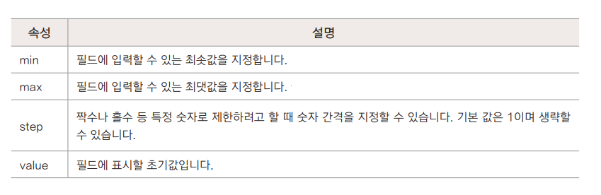
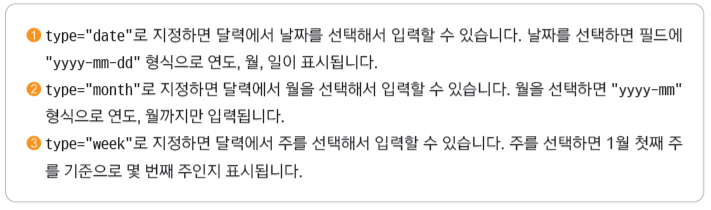

## 폼 삽입하기

- `<form>` 태그
  - 폼 전체를 감싸는 기본 태그
  - `<form>,</form>` 사이에 여러 폼 요소 삽입(텍스트필드, 체크박스,버튼 등 역할마다 다른소스 사용)
- 기본형

```html
<form[속성="속성값"]> 여러 폼 요소 </form>
```

## 폼에서 구역 나누기

- `<fieldset>` 태그

  - 폼 요소를 그룹으로 묶는 태그
  - 필수적인 것 아님, 폼 안의 내용을 그룹으로 묶으려고 할 때 사용
  - 기본형

  ```html
  <fieldset[속성="속성값"]> ~~ </fieldset>
  ```

- `<legend>` 태그

  - 그룹으로 묶는 구역에 제목을 붙이는 태그 제목을 생략할 수도 있다
  - 기본형

  ```html
  <fieldset>
    <legend>그룹 이름</legend>
  </fieldset>
  ```

  - 참고 : 필드셋 테두리 없애기

  ```html
  <style>
    fieldset {
      border: none;
    }
    legend {
      display: none;
    }
  </style>
  ```

## `<input>` 태그

- 한 줄짜리 사용자 입력을 받는 태그 & 버튼을 만드는 태그
- type 속성에 따라 폼 요소가 달라짐
- type 속성 값에 따라 함께 사용할 수 있는 속성도 달라짐

```html
<input type="유형" [속성="값" ] />
```

  
  
  
  
  - 텍스트 필드
  - type = "text"
    * 한 줄짜리 텍스트 입력 필드
    * 주로 아이디나 이름, 주소 등 텍스트 입력
    * 기본형
    ```html
    <input type = "text"[속성]>
    ```
    
  - 패드워드 필드
  - type = "password"
    * 비밀전호 입력
    * 사용자가 입력하는 내용이 ＊ , ●  로 표시된다
    * 기본형
    ```html
    <input type = "password"[속성]>
    ```
예시)
```html
<body>
  <form>
    <fieldset>
      <legend>로그인</legend>
        <ul>
          <li>
            아이디 <input type="text">
          </li>
          <li>
            비밀번호 <input type="password">
          </li>
        </ul>
      </fieldset>
    </form>
</body>
```


## `<label>` 태그

- `<input>` 태그와 같은 폼 요소에 레이블(텍스트)를 붙일 떄 사용
- 레이블과 입력 폼을 연결해 줌
- 웹 표준을 위해 반드시 사용해야 한다. 마크업 하고 CSS를 사용해 화면에서 감출 수 있음
- 방법 1
  - 전체를 감싼다
  ```html
  <label>아이디 <input type="＂text＂" /></label>
  ```
- 방법 2
  - for 속성과 id 속성을 사용한다
  ```html
  <label for="user-id">아이디</label> <input type="text" id="user-id" />
  ```

## 히든 필드

- type = "hidden"
- 화면 상의 폼에는 보이지 않는다
- 사용자에게는 보여주지 않으면서 필요한 정보를 서버로 전송해야 할 때 사용
  - 가입 경로나 가입 날짜를 전달하거나 마케팅에 필요한 정보를 전달하려면 히든 필드로 감춰서 전달
- 주로 `<form>` 태그 다음에 입력
- value 나 id 속성 등 프로그램에서 필요한 정보를 넣어서 전달
- 기본형

```html
<input type="hidden" />
```

## 다양한 입력 폼

- 검색 필드

  - 검색 창에 x 표시가 되어 검색어 삭제가 쉬움
  - 검색어 삭제가 불편한 모바일 화면에서 많이 사용
  - 기본형
    ```html
    <input type="search" ... />
    ```

- 전화번호
  - 전화번호 입력 필드
  - 사용자 입력을 체크하지는 않음
  - 기본형
    ```html
    <input type="tel" />
    ```
- 이메일
  - 이메일 주소 입력 필드
  - 메일 주소 형식 자동 체크
  - 기본형
    ```html
    <input type="email" />
    ```
- 웹 주소
  - 웹주소 입력 필드
  - http://로 시작하는 사이트 주소 입력
  - 기본형
    ```html
    <input type="url" />
    ```
- 색상
  - 색상표를 활용해 색상 선택
  - 기본색을 지정하지 않으면 검은색이 기본으로 표시됨
  - 기본형
    ```html
    <input type="color" [value="기본색#fff" ] />
    ```
- 숫자
  - 숫자 입력 필드
  - 스핀 박스로 표시됨. 화살표를 클릭해 숫자 조절
  - 숫자 이외의 값은 무시
  - 기본형
  ```html
  <input type="number" min="최솟값" max="최댓값" step="간격" />
  ```
  
- 범위
  - 슬라이드 막대를 움직여 범위 안에서 크기 조절
  - 최솟값과 최댓값 사이에서 조절
  - 정확한 값이 중요하지 않을 때 사용(볼륨, 밝기, 투명도 등)
  - 기본형
  ```html
  <input type="range" min="최솟값" max="최댓값" step="간격" />
  ```
- 날짜

  - 달력을 이용해 날짜 입력
  - 기본형

  ```html
  <input type="date" />
  <input type="month" />
  <input type="week" />
  ```

  

- 시간

  - 시간 지정하기
  - 3개의 항목으로 구성(오전/오후, 시, 분)
  - 기본형

  ```html
  <input type="time" />
  ```

  - 날짜와 함께 지정하기
  - 기본형

  ```html
  <input type="datetime-local" />
  ```
