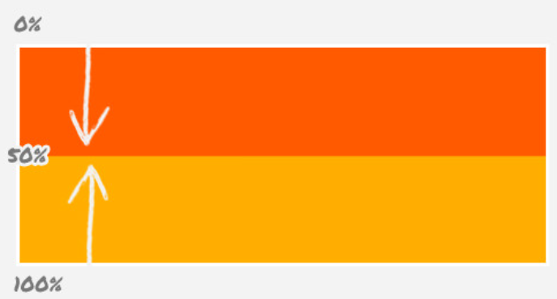
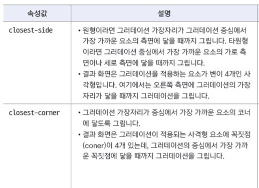
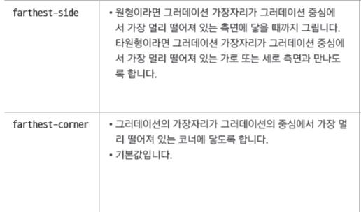

## css gradation

- Gradation : 두가지 이상의 색상이 자연스럽게 연결되어 표시 되는것

  - 선형 그라데이션 : linear-gradient()
  - 원형 그라데이션 : radial-gradient()

## linear-gradient()

- 색상이 수직, 수평 또는 대각선 방향으로 일정하게 변하는것
- 색상이 어느 방향으로 바뀌는지, 어떤 색상으로 바뀌는지 지정해줘야 한다
- 기본형

```css
h1 {
  background: linear-gradient(to right bottom, black, red);
}
```

- 왼쪽 위에서 오른쪽 아래(right bottom)로
- black에서 red로 색상이 변한다

## linear-gradient 각도

- graidtion이 끝나는 각도 지정
- 값은 deg로 표기
- css에서 각도는 맨 윗부분이 0deg 이고 시계 방향으로 회전하면서 증가
- 방향을 사용할 때보다 좀 더 세밀하게 지정할 수 있다

```css
.grad {
  background-color: #f50;
  background: linear-gradient(
    45deg,
    red,
    black
  ); /* 45도 (오른쪽 위)방향으로, red에서 black으로 */
}
```

## linear-gradient 색상 중지점

- 그라데이션에 여러 색상이 사용될 때 색상이 바뀌는 지점
- 색상만 지정할 수도 있고 색상과 함꼐 중지점의 위치도 함께 지정할 수도 있다
- 색상을 지정할 때 rgba()함수를 사용해서 불투명도를 함께 지정할 수 있다  
  

  ```css
  .grad {
    background: #00f;
    background: linear-gradient(
      to top,
      red,
      green 40%,
      blue
    ); /*밑에서 위로 red로 시작 blue로 끝 40%지점에 green*/
  }
  ```

## radial-gradient : 원형 그라데이션

- 원이나 타원의 중심부터 동심원을 그리며 바깥 방향으로 색상이 바뀌는 그라데이션
- 색상이 바뀌기 시작하는 원의 중심과 크기를 지정하고 그라데이션의 모양을 지정해야 한다
- 만들어지는 모양은 circle(원형)과 ellipse(타원형)
- 따로 지정하지 않으면 ellipse
- 기본형

```css
.grad {
  background: radial-gradient(모양 크기 at 위치, 색상 중지점...);
}
```

- 예)

```css
.grad {
  background: rgb(0, 140, 255);
  background: radial-gradient(
    circle at 20% 20%,
    red,
    black
  ); /*원형, 색이 시작되는 위치는 20% 20%  빨강에서 검정으로*/
}
```




## gradation repeat

- repeating-linear-gradient : 선형 그라데이션 반복
- repeating-radial-gradient : 원형 그라데이션 반복

- 그라데이션 패턴 만들기
  - 그라데이션을 반복해서 패턴을 만들 때는 각 색상 중지점의 위치를 적절하게 조절해야 한다
  ```css
  .grad1 {
    background: red;
    background: repeating-linear-gradient(
      yellow,
      yellow 20px,
      red 20px,
      red 40px
    );
  }
  ```
