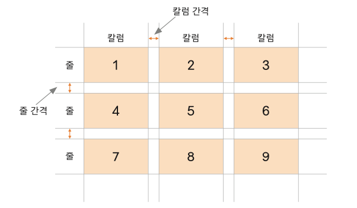
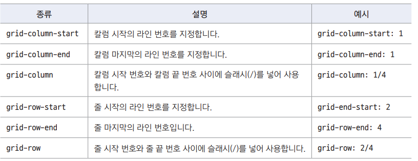
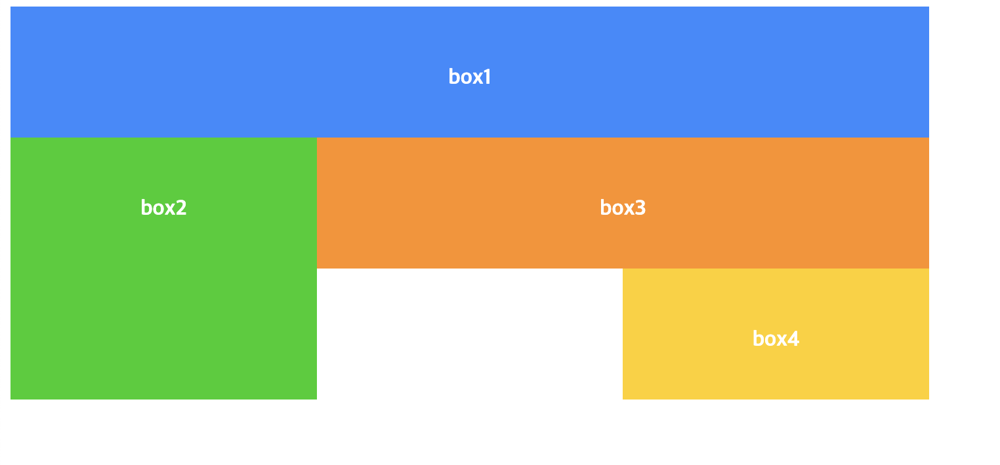
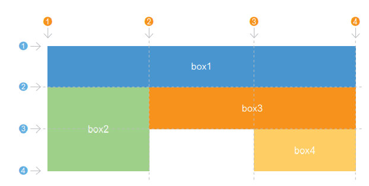
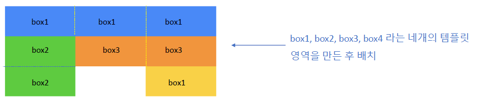
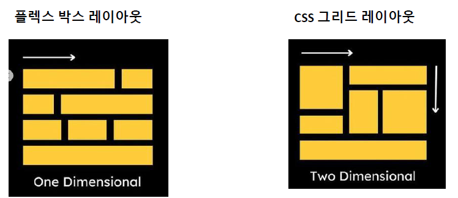
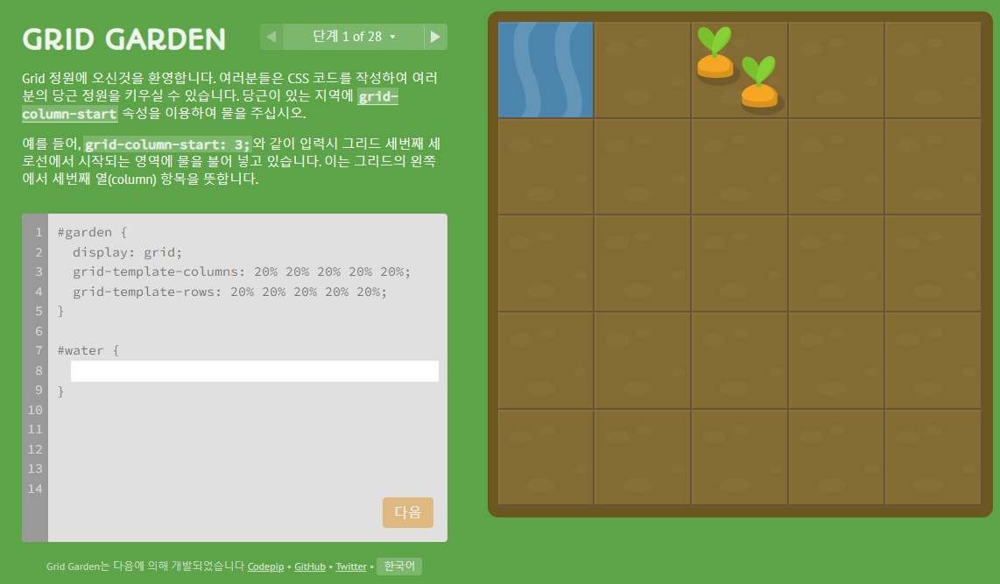

## css grid layout

- Flexbox layout은 주축/교차축 개념이 있지만 css grid layout 은 양쪽 방향 모두 사용한다
- row, column으로 화면을 구성하고, 줄 사이의 여백, 칼럼사이의 여백을 조절한다  
  
- css grid layout 예시 사이트 [https://www.w3.org/TR/css-grid-1/](https://www.w3.org/TR/css-grid-1/)

## display

- css grid layout을 사용하기 위해 부모 요소를 grid container로 지정한다
  - grid : container안의 항목을 블록 레벨 요소로 배치합니다
  - inline-grid : container안의 항목을 인라인 레벨 요소로 배치합니다
  - grid-template-columns : grid container 안의 칼럼 개수와 너빗값
  - grid-template-rows : grid container안의 줄 개수와 너빗값

## fr

- 상대적인 크기를 지정하는 fr 단위
- column/row 의 크기를 지정할 때 px 단위는 적합하지 않다
- ex) 너비의 비율이 2:1:2인 칼럼을 3개 배치하고 싶다면

  ```css
    #container {
      gird-template-columns: 2fr 1fr 2fr;
    }
  ```

## repeat

- 똑같은 값을 여러 번 반복한다면 내장 함수 repeat()함수 사용
- ex)

```css
#container{
  display:grid;
  grid-template-columns: repeat(5, 1 fr);
  grid-template-rows:100px;
}
……
```

- minmax() :높이가 고정되어있어서 그 길이를 넘는 내용은 보이지 않는다
  - minmax() 함수를 사용해서 최소, 최댓값을 지정한다
  - minmax(최솟값,최댓값)

## grid-template

- grid-template-rows와 grid-template-columns를 한꺼번에 지정한다
- / 를 기준으로 왼쪽에는 rows,오른쪽에는 colums값을 지정한다
- ex)

```css
#container{
  grid-template-colums:repeat(3, 1fr)
  grid-template-rows:minmax(100px, auto)
}
```

```css
#container {
  grid-template: minmax(100px, auto) / repeat(3, 1fr);
}
```

## auto-fill, auto-fit

- 브라우저 창의 너비가 달라질 때 칼럼 너비를 어떻게 조절할지 지정한다
- auto-fill : 남는 공간 없이 꽉 채우기
- auto-fit : 칼럼의 최소 너비까지만 표시하고 남는 공간은 그대로 둔다
- ex)

```css
#container {
  grid-template-columns: repeat(auto-fit, 200px);
}
```

## grid 항목 간격 조절

- column-gap : column과 column 사이의 간격 조절
- row-gap : row와 row 사이의 간격 조절
- gap : column과 row 사이의 간격을 한꺼번에 조절
- ex)

```css
#container {
  row-gap: 20px;
  column-gap: 30px;
  gap: 20px 30px;
}
```

## grid line을 사용해 layout 만들기

- css grid layout에는 눈에 보이지 않는 grid line이 포함 되어있다
- grid line을 사용해 grid 항목을 배치할 수 있다  
  
- column-start 또는 row-start 보다 작은 값을 column-end, row-end에 쓸 수 있다. 오른쪽에서 왼쪽으로 , 아래에서 위로 적용

## 여러가지 방식으로 레이아웃 만들어보기

- 이런 레이아웃은 어떻게 만들어야 할까  
   

- box1 ~ box4 영역까지 감싸고 있는 부모 요소를 grid layout container로 지정하고
- column 은 1fr씩 3개
- 줄 height은 minmax(3,100px)로 지정  
  
  - box1 : column line 1 ~ 4
  - box2 : column line 1 ~ 2, row line 2 ~ 4
  - box3 : column line 2 ~ 4
  - box4 : column line 3 ~ 4

```html
<div id="container">
  <div class="box box1">box1</div>
  <div class="box box2">box2</div>
  <div class="box box3">box3</div>
  <div class="box box4">box4</div>
</div>
```

```css
.box1 {
  background-color:#3689ff;
  grid-column:1/4;
}
.box2 {
  background-color:#00cf12;
  grid-row:2/4;
  grid-column start:1;
}
.box3 {
  background-color:#ff9019;
  grid-column:2/4;
  grid-row start:2;
}
.box4 {
  background-color:#ffd000;
  grid-column start:3;
  grid-row start:3;
}
```

## span

- 시작 번호/끝 번호 대신 span 과 함께 셀 몇개를 차지하는지 개수를 지정할 수 있다

```css
.box1 {
  background-color:#3689ff;
  grid-column:1 / span 3;
}
.box2 {
  background-color:#00cf12;
  grid-row:2 / span 2;
  grid-column-start :1;
}
.box3 {
  background-color:#ff9019;
  grid-column:2 / span 2;
  grid-row-start:2;
}
.box4 {
  background-color:#ffd000; 
  grid-column-start:3;
  grid-row-start:3;
}
```

## grid-area 

- grid-area : n1/n2/n3/n4 처럼 grid-area 속성에 4개의 숫자를 지정하면 순서대로 grid-row-start/grid-column-start/grid-row-end/grid-column-end를 나타낸다

```css
.box2{
  background-color:#00cf12;
  grid-row:2 / span 2;
  grid-column-start :1;
}
.box2{
  background-color:#00cf12;
  grid-area:2/1/4/2
}
```

## 탬플릿 영역을 사용해서 layout 만들기

- gridline은 시작 번호와 끝 번호를 일일이 지정해서 layout을 만들어야 하지만 탬플릿 영역은 좀 더 편리하다  
  

## flexbox 와 css gridlayout의 차이  
  
  

- 두 가지를 함께 사용도 가능하다
- flexbox layout
  - 주축의 영역이 부족하면 교차축을 따라 다음 줄로 넘어간다(wrap) 즉, 모든 줄의 저비가 같지 않을 수 있다
- css grid layout
  - Row and column 양쪽을 모두 맞출 수 있기 때문에 깔끔하게 정돈할 수 있다  

## CSS grid layout 연습하는 게임 사이트
- Grid Garden [https://cssgridgarden.com/#ko](https://cssgridgarden.com/#ko)  
    
