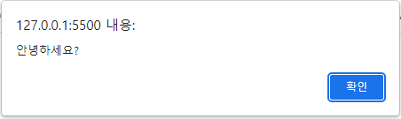
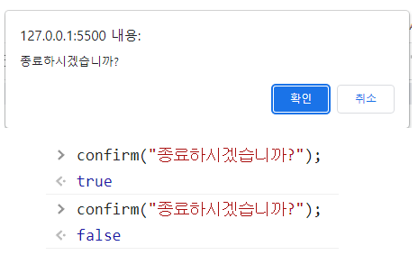
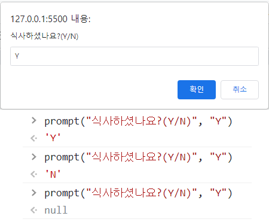

# JavaScript 기초 함수

## alert()

* 알림 창 표시(alert창 이라고도 한다)
* alert() 함수의 괗호 안에 메세지를 입력하거나 변수를 사용한다
  * 알림 창에 텍스타나 변수값 표시
  
  ```html
  <body>
    <script>
      alert("안녕하세요?");
    </script>
  </body>
    ```

  

## confirm()

* 확인 창 표시(confirm창 이라고도 한다)
* [확인] 버튼과 [취소] 버튼이 있어서 사용자가 어떤 버튼을 클릭했는가에 따라 다르게 동작하게 할 수 있다  
* 개발자 도구창(F12) 콘솔에서 작성 및 확인 가능하다

  ```js
  confirm("종료하시겠습니까?");
  ```

  

## 콘솔 창 tip

* 콘솔 창에 소스가 가득찼을때 지우려면 창 위에  클릭
* 이전에 입력했던 소스를 똑같이 입력하려면 ↑방향키 입력
* 콘솔 창이 지워져도 이전에 입력했던 내용이 사라진것은 아니므로 이전 소스를 찾아서 입력할 수 있다
* 콘솔 창에 나타나는 "undefined"는 오류가 아니다
  * 콘솔 창에서는 한 번에 한 줄씩 명령을 실행한 후 그 결과를 콘솔 창에 표시한다
  * 딱히 결과값이 없는 명령을 실행했을 경우에는 결과값 대신 undefined라고 표시한다
  * ex) alert()함수는 화면에 창을 표시하고 나면 따로 결과값이 없기 때문에 undefined라고 나타난다

## prompt()

* 사용자가 간단한 값을 입력할 수 있는 창을 표시한다
* 프로그램 실행에 필요한 값을 받을 때 자주 사용한다
* 기본 값을 지정하지 않으면 텍스트 필드가 빈 상태로 표시된다
* 취소를 누르면 결과값이 null
  
  ```js
  prompt("식사하셨나요(Y/N)","Y")/*뒤쪽 Y는 기본값*/
  ```
  

## console.log()

* 콘솔 창에 괄호 안의 내용을 표시한다
* JS소스를 작성하면서 중간에 프로그램이 제대로 동작하는지 확인하는 용도로 사용
* 콘솔 창에 결과를 표시하는 함수는 많지만 주로 console.log()를 사용한다
* 괄호 안에 텍스트나 변수를 사용할 수 있다

  ```js
  console.log(내용)
  ```

## document.write()

* 괄호 안의 내용을 웹 브라우저 화면에 표시한다
* 실제 웹 브라우저 화면에 내용을 표시할때는 DOM을 사용(후에 설명예정)
* (+) 연결 연산자를 사용할 수 있고, 탬플릿 리터럴을 사용할 수 도 있다

  ```js
  name = "홍길동"
  document.write("제 이름은" + name + "입니다");
  ```