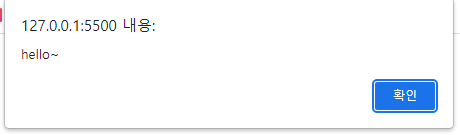
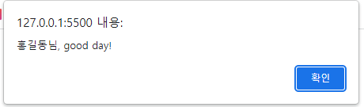

# 자바스크립트 소스를 작성하는 기본규칙

1.코드를 들여쓴다

* tab 키나 spacebar 를 2,4번 들여쓴다
* 최근에는 spacebar 2칸 들여쓰기 많이 사용한다
  
2.세미콜론(;) 으로 문장을 구분한다

* 소스는 한 줄에 한 문장만 작성하는 것이 좋다

3.공백을 넣어 읽기 쉽게 작성한다

* 식별자나 연산자, 값 사이에 공백을 넣어 읽기 쉽게 작성한다

4.코드를 설명하는 주석을 작성한다

* 한 줄 주석: 슬래시2개(//)바로 뒤에 작성
* 여러 줄 주석: 여는 기호```/* 주석내용 */```
* 주석 사이에 또 다른 주석을 넣을 순 없다

5.식별자(변수,함수 이름)는 정해진 규칙을 지켜서 작성한다

* 첫 글자는 반드시 영문자나 (_), ($) 로 시작한다
* 두 단어 이상이 하나의 식별자를 만들 때 단어 사이에 공백을 둘 수 없다
* 예약어는 식별자로 사용할 수 없다

## 웹 문서에서 스크립트 작성학

* 자바스크립트 처리기는 웹 브라우저 안에 포함되어있기 대문에 자바스크립트 소스는 웹 문서에 작성하면 웹 브라우저가 해석한다
* 자바스크립트 소스는 웹 문서안에 직접 작성할 수도 있고
* 따로 파일로 저장해서 연결해서 사용할 수도 있다

## 인라인 스크립트

* html 태그 안에 직접 작성하는 자바스크립트
* 팝업 창을 열고 닫거나, 알림 메세지를 표시할 때처럼 간단한 명령을 처리할 경우 인라인 스크립트를 사용한다

```html
<body>
  <button>클릭</button>
</body>  
```

* 클릭 시 알림 메세지 팝업  



```html
<body>
  <button onclick="alert('hello~')">클릭!</button>
</body>
```

* 인라인 스크립트의 장단점
  * 장점: html문서에 자바스트립트 소스를 한꼐 사용하면 웹 문서에서 소스를 함께 확인 가능하다
  * 단점: html태그와 JS소스가 함께 섞여 있기 때문에 웹 문서의 소삭 복잡하다 

## 내부 스크립트

* 웹 문서에서 `<script> </script>` 사이에 실행할 js 소스 작성
* `<script>` 태그는 웹 문서에서 모든 곳에 위치할 수 있고 삽입된 위치에서 바로 스크립트가 실행된다
* 한 문서 안에 여러 개의 `<script>` 태그 사용 가능
* 내부 스크립트는 주로 `</body>` 태그 앞에 사용한다
  
  

```html
<body>
  <button onclick="hello()">클릭!</button>
  <script>
    function hello(){
      let user ="홍길동";
      alert(user+"님, good day!");
    }
  </script>
</body>
```

* 내부 스트립트의 단점
  * 같은 JS소스를 여러 웹 문서에서 사용해야 할 경우, 필요한 문서마다 똑같은 소스를 반복해서 삽입해야 한다
  * 만일 여러 페이지에 삽입한 JS소스를 수정해야 한다면 소스가 포함된 모든 문서를 다 찾아다니면서 하나씩 수정해야 한다
    * JS소스를 작성할 때 외부 스크립트 파일로 저장해서 링크하는 방법을 많이 사용한다
    * 마크 업과 구별되기 때문에 스크립트 소스를 관리하기가 쉽다

## 외부 스크립트 연결해서 사용하기

* 외부 스크립트 파일 확장자: .js
* html 문서에서 `<script>`태그를 사용해서 외부 스크립트를 연결한다
* 기본형
  
  ```html
  <script src="스크립트 파일경로"></script>
  ```

* 외부 스크립트 파일 안에는 `<script>`태그없이 JS소스만 작성한다
* 따로 js용 폴더를 만들어서 저장하는 것이 좋다(css처럼)
