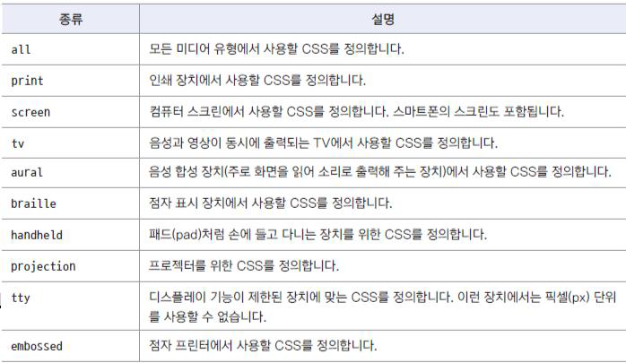
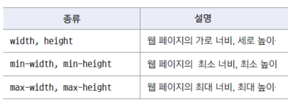
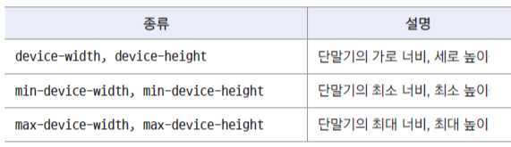
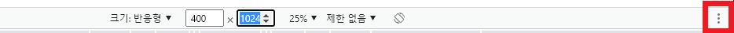
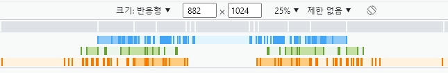
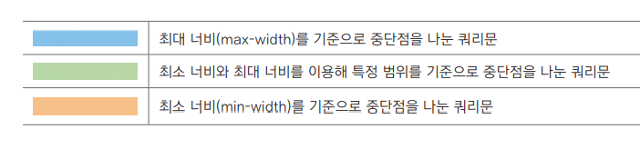

## 미디어 쿼리(media queries)

- 접속하는 장치(media)에 따라 특정한 css 스타일을 사용하는 방법
  - media queries를 사용해 제작된 사이트들 [http://mediaqueri.es](http://mediaqueri.es)
- @media 속성을 사용해 특정 미디어에서 어떤 css를 적용할 것인지 지정한다

```html
<style>
  @media only 또는 not 미디어 유형 and 조건 and 조건 .... {
  }
</style>
```

- only : media queries를 지원하지 않는 web browser에서는 media queries를 무시하고 실행 하지 않는다
- not : not 다음에 지정하는 미디어 유형을 제외한다. not TV : TV를 제외한 미디어 유형에만 적용한다
- 예) 미디어 유형이 screen 이고 최소너비가 768px, 최대 너비는 1439px일경우에 적용하는 css

```css
@media screen and (min-width: 768px) and (max-width: 1439px) {
  ...;
}
```

- 미디어 유형  
  

## condition : size of viewport

- 실제 웹 문서 내용이 나타나는 영역(viewport)의 너비와 높이를 조건으로 사용
  
- 예) 화면 너비가 1440px 이상일때

```css
@media screen and(min-width:1440px) {
  ...;
}
```

## condition : size of device

- Doesn't use often
  
- web site : viewport size for each device [https://yesviz.com/devices.php](https://yesviz.com/devices.php)

## condition : screen orientation

- 스마트폰이나 태블릿에서 기기를 가로나 세로로 돌려보는지 확인
- orientation: portrait 단말기 세로모드
- orientation: landscape 단말기 가로모드
- 더많은 조건 속성들 : [www.w3.org/TR/mediaqueries-4](www.w3.org/TR/mediaqueries-4)

## media queries breakpoint

- breakpoint(중단점) : 서로 다른 css를 적용할 화면 크기
- 대부분 기기의 viewpoint 화면 크기를 기준으로 나눔
- 모든 기기를 반영할 수 없기 때문에 스마트폰과 태블릿, 데스크톱 정도로 구분
- 사이트 특성에 따라 더 세분화할 수도 있음
- mobile first : 모바일 기기 layout을 기본으로 작성
  - 태블릿,pc에 대한 media queries 사용해 layout 작성
- PC first : PC 기준으로 레이아웃 작성

  - 태블릿, 모바일에 대한 media queries 사용해 layout 작성

- 일반적인 사용 예

  - 스마트폰 : 모바일 페이지는 media queries를 사용하지 않고 기본 css로 작성
    - 스마트폰의 방향까지 고려할 경우 : portrait 320px, landscape 480px
  - 태블릿 : 세로 크기가 768px 이상이면 태블릿으로 지정. 가로 크기는 desktop과 똑같이 1024px로 지정
  - desktop : 화면 크기가 1024px 이상

- 실제 사이트에서 media queries 확인하기

  - F12(Windows), Option + Command + I (MAC) 클릭
  - 크롬 웹 개발자 도구 창의 왼쪽 위에 있는 버튼 클릭
  - 설정버튼 클릭  
    
  - 다양한 바 들을 클릭하면 그 값에 맞게 화면이 바뀐다  
    

    

- 사이트에서 사용한 소스를 확인하고 싶다면
  1. media queries 중단점 우클릭 후 [소스 코드에서 보기]에 hover 하면
  2. 사용된 css file이 표시된다
  3. css file을 선택하면 [소스]탭에 해당 소스가 나타난다

## media queries 적용하는 방법 2가지

1. style tag 안에서 media 속성 사용하기

```html
<style media="screen and (max-width : 320px)">
  body {
    background-color: green;
  }
</style>
```

2. @media 문 사용

```html
<style>
  @media screen and (max-width: 320px) {
    body {
      background-color: green;
    }
  }
</style>
```
