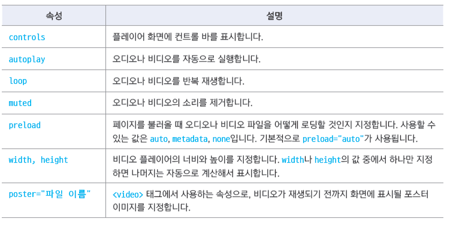

## 플러그인 프로그램
- html5 이전에는 웹 브라우저에서 멀티미디어를 직접 재생할 수 없기 때문에 플러그인 프로그램 연결해서 사용
- 재생하려는 미디어 파일 형식에 따라 사용하는 플러그인 프로그램이 달라진다
  * .swf파일 : 플래시 플레이어
  * .wmv파일 : 윈도우 미디어플레이어 필요
  * .mov파일 : 퀵타임 플레이어
  * ActiveX : 일부 사이트에서 사용  
  
- 멀티미디어 표준화
  * html4 까지는 웹 브라우저에서 멀티미디어를 직접 재생할 수 없었음(플러그인 필요)
  * html5 웹 표준 이후 웹 브라우저에서 직접 멀티미디어 재생
  
- 멀티미디어 표준화(비디오 코덱)  
  * H.264 : 매우 높은 압축률을 가지면서 고화질의 영상지원(기존에는 MPEG-4 Part2사용)
    + 주로 .mp4 파일에 많이 사용
    + 유료 코덱이지만 웹에서 사용할 경우 무료
  * 오그 테오라(Ogg Theora) : 공개 코덱(무료) .ogv파일에 주로 사용
  * VP8 / VP9 공개코덱. .webm파일에서 주로 사용됨

- 멀티미디어 표준화(오디오 코덱)  
  * MP3(MPEG-1 AUDIO Layer3)
    + mp3는 오디오 압축 형식으로,PCM 오디오 데이터 중에서 실제 사람이 들을 수 없는 부분이나 필요없는 부분을 버리고 다시 인코딩 하는 방식
    + 음질을 좋게 하려면 파일 크기가 커짐
    + mp3는 1991년에 표준화 되었고 특허권이 등록되어 있음
  * AAC(Advanced Audio Coding)
    + 애플의 아이폰 아이팟 아이튠즈에서 사용되느니 기본 오디오 형식
    + 1997년에 표준화 되었고 특허권이 등록되어 있음
  * Vorbis
    + 오픈 소스이며 누구나 무료로 사용할 수 있는 오디오 코덱
    + 확장자는 .ogg 나 .oga 사용
    + 재생할 수 있는 플레이어가 적고 인코딩 시간이 더 걸린다는 단점
    + 무료로 사용할 수 있기 때문에 pc게임 등에 많이 사용됨

- 비디오 파일 삽입 예시

```html
<embed src="medias/flight.mp4" width="400" height="300"><!--width,height 크기지정시 px없음-->
```
- 오디오 파일 삽입 예시

```html
<embed src="medias/spring.mp3">
```

## `<object>` 태그 사용하여 다양한 개체 삽입
- 오디오, 비디오, pdf등 다양한 개체 삽입 가능
- 기본형
  * 기본형 
  
```html
<object data="파일" type=＂유형"></object>
```
- data : 재생 할 파일 지정
- type : 처리해야 할 문서의 유형
- 화면크기를 지정하고 싶다면 width, height 속성 사용

예시).pdf

```html
<object data="media/product.pdf" type="application/pdf" width="900" height="800" ></object>
```
예시).mp3(오디오)

```html
<audio src="medias/spring.mp3" controls></audio><!--controls는 재생막대 표시-->
```
예시).mp4(비디오)

```html
<video src="medias/salad.mp4" width="700" controls></video>
```


## 포스터 이미지 사용(썸네일)
- 포스터 이미지: 비디오를 재생하기 전에 화면에 표시 되는 이미지(썸네일)

```html
<video src="media/dog.mp4" width="700" controls poster="image/bordercollie.jpg"></video>
```

## `<iframe>` 태그
- inline frame 의 줄임말
- 웹 문서 안에 다른 외부 문서 삽입
- 문서의 소스를 보이지 않게 할때 사용한다

```html
<iframe src="문서나 사이트 경로" [속성]></iframe>
```

예시)

```html
  <iframe width="560" height="315"
  src="https://youtube.com/embed/XuhmrUwSKbA" title="YouTube video player"
  frameborder="0" allow="accelerometer; autoplay; clipboard-write; encrypted-media;
  gyroscope; picture-in-picture" allowfullscreen></iframe>
```
