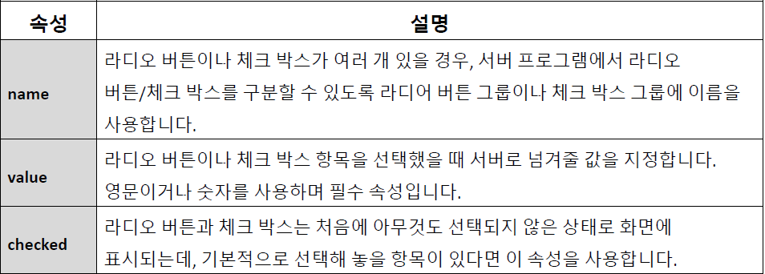

## 라디오 버튼과 체크 박스

- input 태그의 type 값에 따라 라디오 버튼이나 체크 박스를 만들 수 있다
- 라디오 버튼: 여러 항목 중에서 하나만 선택
- 체크 박스: 여러 항목 중에서 복수 선택 가능
- 기본형

```html
<input type="radio" /> <input type="checkbox" />
```



- 파일 첨부 버튼
  - 파일 선택, 찾아보기 버튼으로 표시됨
  - 기본형
  ```html
  <input type="file" />
  ```
- 전송 버튼
  - 폼 전송 버튼
  - 사용자 입력 내용을 서버로 전송
  - value 속성을 이용해 버튼 표시 내용 지정
  - 기본형
  ```html
  <input type="submit" value="내용" />
  ```
  - submit 대신 이미지 삽입
  - 기본형
  ```html
  <input type="image" src="이미지 파일경로" alt="대체 텍스트" />
  ```
- 취소(리셋) 버튼
  - 폼 취소(리셋) 버튼
  - 사용자 입력 내용 삭제
  - value 속성을 이용해 버튼 표시 내용 지정
  - 기본형
  ```html
  <input type="reset" value="내용" />
  ```
- 전송 버튼, 리셋 버튼 둘 다 아닐떄
  - 기능 없이 버튼 형태만 삽입
  - 주로 버튼 클릭해서 자바스크립트 실행할 때 사용
  - value 속성을 이용해 버튼 표시 내용 지정
  - 기본형
  ```html
  <input type="button" value="내용" />
  ```

## '<button>' 태그

- '<input>' 태그에서 type="submit", type="reset", type="button" 을 사용해서 버튼을 삽입하는 것은 HTML 초기부터 있었던 기능
- HTML5 부터 '<button>'태그 도입
- 태그만 보고 '버튼' 이라는 사실을 알 수 있음(시맨틱 태그)
- 단순히 폼의 버튼 뿐만 아니라, 웹 문서 어디에서든 눌러야 할 부분에는 '<button>' 태그를 사용할 수 있다

- 폼에서 '<button>' 태그 사용
  - 폼 전송 버튼
  - 기본형
  ```html
  <button type="submit">내용</button>
  ```
  - 폼 취소(리셋) 버튼
  - 기본형
  ```html
  <button type="reset">내용</button>
  ```
  - 기능 없는 버튼
  - 기본형
  ```html
  <button type="button">내용</button>
  ```
#### `<button>` 태그로 전송(submit) 기능을 만들때 반드시 submit을 사용해야 하는 것 은 아님. 사이트 마다 다양하게 사용됨.
