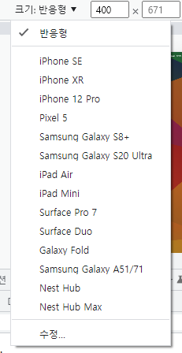

## 반응형 웹을 사용하는 이유

- PC나 노트북보다 더 작은 스마트폰에서 웹 사이트에 접속하는 경우가 많다
- PC와 스마트폰의 화면 크기는 다르므로 pc용으로 만든 웹 사이트를 스마트폰에서 접속하면 읽기 힘들다
- 스마트폰이나 테블릿, 스마트TV등 브라우저 환경이 다양하게 바뀌는데 그때마다 웹 사이트를 각각 제작하는 것은 추가적인 부담
- 모바일 방문자가 많은 경우 모바일용으로 만들고 PC방문자가 많은 사이트의 경우 반응형으로 처리
- 규모가 작은 경우 한번에 반응형으로 처리한다

## 반응형 웹 디자인(Responsive Web Desgin)

- 웹 사이트의 내용을 그대로 유지하면서 다양한 화면 크기에 맞게 웹 사이트를 표시하는 방법
- 화면 크기에 반응해 화면 요소들을 자동으로 바꾸어 사이트를 구현하는 것이 바로 반응형 웹 디자인이다
- css3 기능을 사용해 반응형 웹을 제작
  - css3를 지원하지 않는 IE 등 브라우저에서는 사용불가
- 장점
  - 기기의 화면크기나 해상도에 구애 받지 않는다
  - 화면의 변화에 즉시 반을
  - 어느 기기에서든 사이트 주소가 동일하다
  - 유지 관리가 편하다
  - 최신 웹 표준을 따른다
- 단점
  - 예전 브라우저 버전과 호환성
  - 사이트 디자인이 상대적으로 단순하다
- 웹사이트에서 확인 가능하다
  - F12(Windows), Option + Command + I (MAC) 클릭
  - 크롬 웹 개발자 도구 창의 왼쪽 위에 있는 버튼 클릭
  - 직접 화면 조절해보기  
    
  - 제공하는 모바일 뷰포트 사이즈 확인해보기  
    

## Several ways to desgin responsive web

- Media Queries
  - Apply different css file for each devices access web
  - Can show different layout for each devices
  - Included in css3 standard regulation.
- Bootstrap [getbootstrap.com](Http://getbootstrap.com)
  - Most popular css framework, which provide responsive grid system, variable component, JavaScript ..etc.
  - Bootstrap can use many plugins, have potential for expand skills

## Viewport

- 스마트폰에서 실제 콘텐츠가 표시되는 부분
- viewport를 지정하지 않을 경우 스마트폰에서 문서 안의 글자나 이미지가 아주 작게 표시된다
- PC화면과 모바일 화면의 px 표시방법이 다르기 때문이다
  - 문서의 콘텐츠를 스마트폰 화면에 맞춰 표시해야
  - Viewport를 지정하면 기기화면에 맞춰 확대하거나 축서해서 내용을 표시한다
- viewport 지정하기

```html
<head>
  <meta name="viewport" content="속성1=값1, 속성2=값2....." />
</head>
```

  
- 예시) 웹 페이지의 viewport width를 device-width 에 맞추고, 초기배율(initial-scale)을 1.0으로 지정한다

```html
<head>
  <meta name="viewport" content="width=device-width, initial-scale=1.0" />
</head>
```

- viewport scale
  - vw(viewport width): 1vw는 뷰포트 너비의 1%, 100vw는 너비 전체
  - vh(viewport height): 1vh는 뷰포트 높이의 1%, 100vh는 높이 전체
  - vmin(viewport minimum): 뷰포트의 너비와 높이 중에서 작은 값의 1%
  - vmax(viewport maximum): 뷰포트의 너비와 높이 중에서 큰 값의 1%
  - 예시)
  ```css
  #desc {
    width: 50vw; /*viewport width 의 1/2*/
    height: 50vh; /*viewport height 의 1/2*/
  }
  ```

## 가변 그리드 레이아웃(Fluid Grid Layout)

- 간단히 각 요소의 너빗값만 늘였다 줄였다 할 수 있게 만드는 방법
- 디자인이 아주 간단할 경우 편리하다
- css3를 지원하지 않는 브라우저에서도 사용 가능하다
- 가변 레이아웃이라고도 불린다

## 가변 레이아웃 vs 고정 그리드 레이아웃(Fixed Grid Layout)

- 고정 레이아웃 : 화면 너비를 일정하게 고정한 레이아웃
- 가변 레이아웃 : 화면 너비를 % 같이 가변 값으로 지정한 레이아웃
- 가변 레이아웃을 사용할 경우, 너빗 값이 줄어들면 실제 콘텐츠를 확인하기 불편하므로 가능하다면 간결한 디자인을 사용

## 그리드 시스템(grid system)

- 화면을 여러개의 column으로 나누어, 필요할 때마다 column들을 묶어 배치하는 방법
- 화면 너비 값에 따라 '960 grid system','1200 grid system' 등으로 나뉜다
- column 개수에 따라 '12 column grid system', '16 column grid system', '24column grid system' 등올 나뉜다
- 주로 960 픽셀 12 칼럼의 그리드 시스템
  

  ## How to make Fluid Grid Layout

  - Change (px) using layout to (%) using layout

  1. 컨테이너 부분 수정하기

  ```css
  .container{
    width : 70% /*960p 기준*/
    margin : 2.0833% auto; /* 20px auto 기준*/
  }
  ```

2. 각 요소의 너빗값 계산하기

- (요소의 너비/#wrapper의 저비)\*100
- 소수점 2~3자리까지 표시
- 너비와 함께 패딩, 마진도 백분율 값으로 조절하는것이 자연스럽다

```css
/*이것을*/
header {
  width: 960px;
}
.content {
  width: 600px;
}
.right-side {
  width: 360px;
}
footer {
  width: 960px;
}
/*이렇게*/
header {
  width: 100%;
}
.content {
  width: 62.5%;
}
.right-side {
  width: 37.5%;
}
footer {
  width: 100%;
}
```
