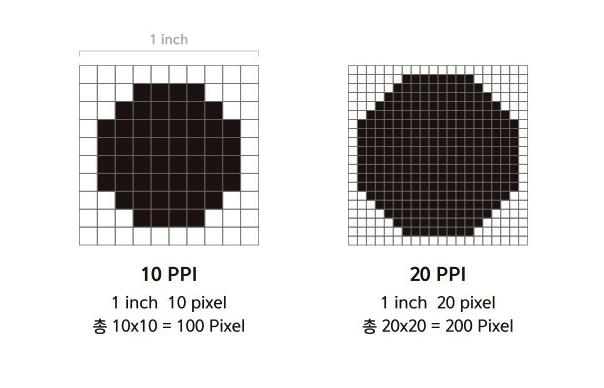
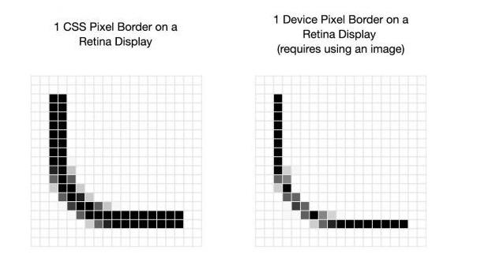

## 반응형 이미지(Responsive image)

- Even if the layout is responsive, images,videos..etc inside of layout maintain their original size
- It doesn't matter if the screen is big enough but when it gets smaller size could be different as intended

## Responsive image : max-width

- 반응형 이미지를 만드는 가장 간단한 방법은 이미지의 최대 크기를 100%로 지정해서 아무리 커져도 부모요소를 벗어나지 않도록 하는 것이다

```css
. container img {
  max-width: 100%;
  height: auto;
}
```

- max-width를 사용할 때 문제점

  - 모바일 기기에서 불필요한 고해상도 이미지를 다운오르 하게 된다
  - 모바일 기기는 가로로 볼 때 와 세로로 볼 때 이미지가 차이가 크다

## PPI(Pixels Per Inch)

- 1인치 안에 픽셀이 몇 개가 들어있는지를 나타내는 수치. 인치당 픽셀 수
- 픽셀 밀도가 높을수록 한 공간에 표현할 수 있는 데이터 양이 많아지기 때문에 세밀한 표현 가능  
  
- 참고
  - DPI(Dot Per Inch) 역시 인치 당 픽셀수를 나타내지만, 이것은 인쇄를 기준으로 측정하는 단위이다
  - 최근에는 인쇄 보다는 화면에서의 인치 당 픽셀수를 따지기때문에 PPI를 사용하는데, 아직 PPI 대신 DPI를 사용하는곳도 있다

## 주요 px 밀도

- 96 : 윈도우에서 모니터 기본 DPI로 사용하는 크기
- 144 ~ 150
  - 일반 프린터의 DPI
  - 30인치 4K UHD 모니터
- 216 : 노트북, iMac용 레티나 디스플레이
- 288 ~ 300
  - 가정용 고품질 프린터의 DPI
  - 레티나 디스플레이
  - 아이패드, 안드로이드 등의 태블릿
- 400 ~ 600 : 고해상도의 스마트폰에서 사용하는 PPI

## 픽셀 밀도(pixel ratio)

- 해상도는 기기의 실제 픽셀 갯수
- 우리가 만드는 문서는 css의 픽셀 크기로 지정
- 해상도의 1픽셀이 css의 1픽셀과 똑같지 않다!(물리적 픽셀vs논리적 픽셀)
- 픽셀 밀도 : css픽셀이 1개의 물리적인 픽셀 몇 개를 넣을까? (해상도 픽셀/viewport 픽셀) : DPR(Device Pixel Ratio)
- 해상도가 높으면 픽셀 밀도가 높아진다(css픽셀 1개 안에 더 많은 물리적 픽셀이 들어간다)
- 픽셀 밀도가 높으면 이미지가 깔끔하고 선명해진다  
  

## Responsive image : srcset

- 기기에 따라 다르게 보여줄 수 있도록 같은 이미지를 해상도에 따라 여러개 준비 img tag에서 srcset 속성을 사용해 이미지를 지정한다

```html

```

1. 화면 너비에 따라 이미지 파일을 다르게 지정하려고 할때

- ex) 기본 이미지:pic.png, 화면 너비가 1024px이상 : pic-large.png , 화면 너비가 640px이상 : pic-medium.png, 화면 너비가 320px이상: pic-small.png, r

```html

```

2. 픽셀 비율에 따라

- ex) 픽셀 비율이 2x일 경우(레티나) pic-hd.png사용

```html

```

3. 화면 너비에 따라 이미지 파일을 다르게 지정하려고 할 때

- 기본 이미지 : images/pic.jpg
- 1024px 이상 : images/pic.jpg
- 768px 이상 : images/pic.jpg
- 320px 이상 : images/pic.jpg

```html
<body>
  <picture>
    <source srcset="images/pic-large.jpg" media="(min-width:1024px)" />
    <source srcset="images/pic-medium.jpg" media="(min-width:768px)" />
    <source srcset="images/pic-small.jpg" media="(min-width:320px)" />
    
  </picture>
</body>
```
