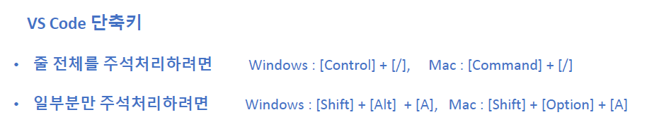
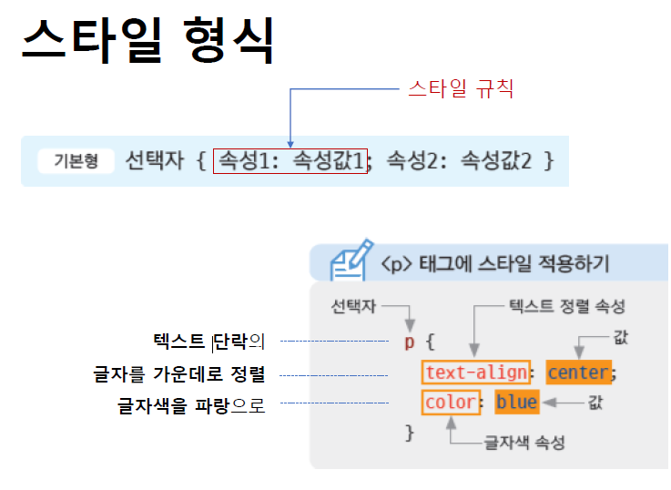
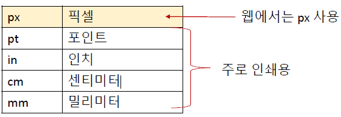
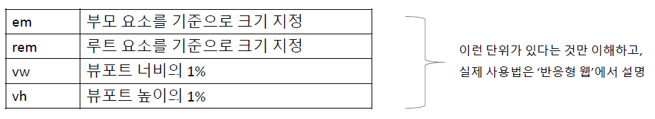

## 스타일과 스타일 시트

- 스타일(style)
  - HTML 문서에서 자주 사용하는 글꼴이나 색상, 정렬, 각 요소들의 배치 방법 등 문서의 겉모습을 결정짓는 내용들
- 스타일 시트(style sheet)

  - 문서에서 사용하는 스타일이 많을 경우, 스타일을 관리하기 쉽도록 한 군데 모아 놓은 것
    - 내부 스타일 시트 : 웹 문서 안에서 사용할 스타일을 문서 안에 정리한 것
    - 외부 스타일 시트 : 여러 웹 문서에서 사용할 스타일을 별도 파일로 저장해 놓고 필요할 때마다 파일에서 가져와 사용함

- 브라우저 기본 스타일

  - 브라우저에서 기본으로 적용 되는 스타일
  - 웹 문서에서 아무 스타일도 적용하지 않고 HTML만 사용해도 그 기능에 따라 크기에 맞게 보여줌

- 스타일 시트(style sheet)

  - 브라우저 기본 스타일이 처음부터 적용 되어있다
  - 사용자가 필요할 때마다 원하는 부분의 스타일을 만들어서 사용
  - 브라우저 기본 스타일과 스용자 스타일이 겹치면 사용자 스타일 적용

## 인라인 스타일(inline style)

- Instead of using style sheet, apply style directly
- Apply style to whichever tag you want to apply style
- ex)

```html
<h1 style="속성:속성 값"></h1>
```

- 인라인 스타일의 단점
  - 스타일을 여러군데 적용하기 위해서는 같은 소스를 여러번 작성해야한다
  - 수정도 하나하나 해줘야한다
  - ☆ 선택자(selector) 를 사용하면 한꺼번에 스타일을 지정할 수 있다
    - `<p>` 태그 사용한것들 모두 적용

## CSS 주석

- css 주석은 /_ 여기 _/ 사이에 내용을 입력
- 여러 줄도 가능
- VS Code 단축키
  

## 스타일 시트(style sheet)

- 웹 문서 안에는 여러 개의 스타일 규칙이 존재한다
- 스타일을 한 군데에서 관리할 수 있도록 모아 놓은 것
  

- 스타일 시트 규칙 작성법
  - 중괄호 {} 사이에 스타일 규칙 나열
  - 규칙이 여러 개일 경우 ; 으로 구분
  - 예)
  ```css
  p {
    text-align: center;
    color: blue;
  }
  ```

## 내부 스타일 시트

- 문서 안에 스타일 시트를 한께 포함
- 내부 스타일 시트는 <head>내부스타일시트</head> 사이에 넣는다
- <style>내부스타일시트</style>사이에 사용할 스타일 작성
- 문서 안에 사용하기 때문에 현재 문서에만 적용됨
  - 사이트의 전체 문서에서 공통으로 사용하는 스타일은 `외부스타일시트`
  - 현재 페이지에만 따로 사용하는 스타일이 있다면 `내부스타일시트`

## 외부 스타일 시트

- 웹 문서 밖에 별도의 스타일 시트 파일을 만든다. 확장자는 .css
- `<link>` 태그를 사용해 연결할 외부 스타일 시트 지정
- 스타일을 한번 만 정의 하고 사이트 안의 다른 문서에도 적용
- 기본형
  ```html
  <link rel="stylesheet" href="css 파일경로" />
  ```

## `<link>` 태그

- 웹 문서에 외부 파일을 연결하기 위한 태그
- rel 속성 : 연결하는 파일의 유형. 참고자료:[https://developer.mozilla.org/ko/docs/Web/HTML/Link_types](https://developer.mozilla.org/ko/docs/Web/HTML/Link_types)
- href 속성 : 연결하는 파일의 경로
- 예)

```html
<linkrel ="“stylesheet”href" ="“style.css“">
  : style.css 라는 stylesheet 유형의 파일 연결
  <link rel="“icon”" href="“favicon.ico”" /> : favicon.ico 라는 icon 유형의 파일
  연결</linkrel
>
```

## [참고] css 경량화(minify)

- 웹 브라우저에서 css를 해석할 때는 선택자와 속성, 속성값 만 필요
- css 소스에는 주석이나 줄바꿈, 공백등의 소스를 이해하는데 필요하지 않은 여러 요소가 있음
- css 소스는 네트워크를 통해 전달되기 때문에 최대한 파일 크기를 줄이기 위해 주석, 공백등을 제거 하는 방법
- 'css minify' 를 검색하면 다양한 툴이 있다

## css 단위

- 스타일 규칙의 값

  - css의 모든 속성에는 그 속성마다 사용할 수 있는 값이 있다
  - css 값은 길이(length) 나 색상(color) 을 나타냄
  - 숫자를 사용할 수도 있고, 예약어(keyword)를 사용할 수도 있다

- 웹에서의 길이

  - css에서 길이를 나타낼 때는 10px, 2em 등 숫자와 단위를 함께 지정한다
  - 절대 크기, 상대 크기 2가지 유형이 있음
  - 절대 크기
    
  - 상대 크기
    
    - 백분율 상대크기 : 특정 크기를 기준으로 상대적인 크기를 % 로 지정

- 픽셀(pixel)

  - 픽셀 : 화면의 표준 측정 단위. picture element의 줄임말(화소)
  - 화면에 보이는 모든 것은 픽셀 단위로 이루어져 있음
  - 평면상에 가로세로의 좌표값을 매기고 각 좌표값마다 어떤 색의 점을 찍을 지를 데이터로 정의

  - 해상도(resolution) : 픽셀의 밀도
    - 1024\*768 해상도 : 가로 1024개, 새로 768개의 픽셀로 화면 표시
    - 4k 해상도 : 가로 4000개의 픽셀로 화면 표시
    - 5000만 화소 카메라 : 사진을 5000만 개의 픽셀로 처리한다

## 웹에서의 색상

- 16진수 표기법

  - `#ffff` 처럼 # 함께 6자리의 16진수로 표시
  - 앞에서 부터 두자리씩 묶어 red, green, blue 양
  - 하나도 섞이지 않았을 때는 00, 가득 은 ff
  - 000000 검은색 ~ ffffff 흰색
  - 두자리씩 중복될 경우 줄여 사용 가능(#ffff00 -> #ff00, #cccccc -> #ccc)

- rgb / rgba 표기법

  - color : rgb(255,0,0) 처럼 세 자리의 숫자로 표시
  - 앞의 숫자부터 red, green, blue 양
  - 하나도 없을땐 0, 가득 255
  - 백분율도 사용 가능 0% ~ 100%
  - 투명도를 조절할때는 마지막에 알파값 추가 ex) color:rbga(255,0,0,0.3)
  - 알파값 : 불투명도를 나타내는 값
    - 0 ~ 1 중에서 사용(0: 투명 , 1: 불투명)
    - 0% ~ 100% 사용(0%: 투명, 100%: 불투명)

- hsl / hsla 표기법
  - color : hsl(240, 100%, 50%) 세자리로 표시
  - 앞의 숫자부터 색상(hue), 채도(saturation), 밝기(light)
  - 투명도를 조절할 때는 마지막에 알파값 추가 ex) hsla(240,100%,50%,0.3)
  - 알파값 : 불투명도를 나타내는 값. 0 ~ 1 값 중에서 사용(0은 완전투명 1은 불투명)
