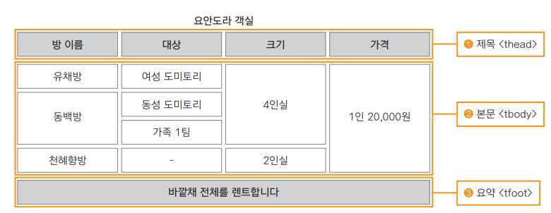

## 표의 구성요소
- 표를 만드는 태그
  * `<table>` : 표 전체
  * `<caption>` : 표 제목
  * `<tr>` : 행 table row
  * `<td>` : 셀 table data
  * `<th>` : 제목 셀 table heading
  
  
## 표 만들기
- 기본적으로 css 사용하지 않으면 테두리는 안보이기 때문에  
  border="1"을 넣어서 보이게한다
```html
<table border="1">  
  <caption> 표 제목</caption>
  <tr>
    <td>내용1</td>
    <td>내용2</td>
    <td>내용3</td>
  </tr>
  <tr>
    <td>내용4</td>
    <td>내용5</td>
    <td>내용6</td>
  </tr>
</table>
```

## 표 구조 정의하기
- 자료를 정리해서 보여주는 표일 경우, 구조화 시키는게 좋다
- 표의 구조는 '제목','본문'과 '요약' 부분으로 나눈다
- `<thead>,<tbody>,<tfoot>` 태그 사용
- 웹 브라우저 화면에서 보이지 않지만, 화면 낭독기나 자바스크립트 등에서 읽을 수 있다. 시각장애인도 표의 구조이해 가능
- 표의 본문이 길 경우 자바스크립트를 이용해 제목과 바닥 부분을 고정하고 본무남 스크롤 되도록 할 수 있다.
- 


```html
<table border="1">
  <caption>표구조나누기</caption>
  <thead>
    <tr>
      <th>번호</th>
      <th>이름</th>
      <th>주소</th>
    </tr>
  </thead>
  <tbody>
    <tr>
      <td>1</td>
      <td>홍길동</td>
      <td>서울</td>
    </tr>
    <tr>
      <td>2</td>
      <td>허준</td>
      <td>부산</td>
    </tr>
  </tbody>
</table>
```
