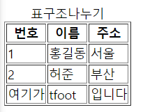

## 표의 구성요소
- 표를 만드는 태그
  * `<table>` : 표 전체
  * `<caption>` : 표 제목
  * `<tr>` : 행 table row
  * `<td>` : 셀 table data
  * `<th>` : 제목 셀 table heading
  
  
## 표 만들기
- 기본적으로 css 사용하지 않으면 테두리는 안보이기 때문에  
  border="1"을 넣어서 보이게한다
```html
<table border="1">  
  <caption> 표 제목</caption>
  <tr>
    <td>내용1</td>
    <td>내용2</td>
    <td>내용3</td>
  </tr>
  <tr>
    <td>내용4</td>
    <td>내용5</td>
    <td>내용6</td>
  </tr>
</table>
```

## 표 구조 정의하기
- 자료를 정리해서 보여주는 표일 경우, 구조화 시키는게 좋다
- 표의 구조는 '제목','본문'과 '요약' 부분으로 나눈다
- `<thead>,<tbody>,<tfoot>` 태그 사용
- 웹 브라우저 화면에서 보이지 않지만, 화면 낭독기나 자바스크립트 등에서 읽을 수 있다. 시각장애인도 표의 구조이해 가능
- 표의 본문이 길 경우 자바스크립트를 이용해 제목과 바닥 부분을 고정하고 본무남 스크롤 되도록 할 수 있다.


```html
<table border="1">
  <caption>표구조나누기</caption>
  <thead>
    <tr>
      <th>번호</th>
      <th>이름</th>
      <th>주소</th>
    </tr>
  </thead>
  <tbody>
    <tr>
      <td>1</td>
      <td>홍길동</td>
      <td>서울</td>
    </tr>
    <tr>
      <td>2</td>
      <td>허준</td>
      <td>부산</td>
    </tr>
  </tbody>
  <tfoot>
   <tr>
     <td>여기가</td>
     <td>tfoot</td>
     <td>입니다</td>
   </tr>
 </tfoot>
</table>
```
## 표 테두리를 위한 CSS
- 따로 CSS파일에 연결하기 전에는 `</head>`앞에 추가한다
```html
<style>
 table, th, td {
   border: 1px solid #ccc; <!--테두리--> 
  }
  th, td {
   padding: 10px; <!--셀의 안 여백-->  
   text-align: center; <!--텍스트 가운데 정렬-->  
  }
  th {
   background-color: #eee; <!--제목 셀 배경색-->  
 }
</style>

```

## 표 편집하기
- 행은 `<tr>`태그를 사용하고, 셀은 `<td>`태그를 사용하지만, 열 전체를 나타내는 태그는 없기 때문에 별도의 태그가 필요하다
### `<col>,<colgroup>` 열끼리 묶어서 스타일을 지정하는 방법
- `<col>` 태그 : 한 열에 있는 모든 셀에 같은 스타일을 적용하려고 할 때 사용한다. ※닫는태그 없음
- `<colgroup>` 태그: 여려개의 열을 묶을 수 있고 태그 안에 묶는 열의 개수 만큼 `<col>`태그 사용. ※닫는태그 있음
- `<col>` 태그와 `<colgroup>`태크는 `<caption>` 태그 뒤에, `<tr>,<td>` 태그 전에 사용해야 함
- `<colgroup>` 태그 안에 있는`<col>` 태그를 비롯해 단독으로 사용한`<col>`태그의 개수와 표의 열의 개수가 같아야 함


```html
  <table border="1">
    <caption>표 편집하기</caption>
    <col style="background-color:red;"> <!--첫번쨰 열-->
    <colgroup style="background-color:#f0ffff"> <!--두번째 부터 순서대로 묶음-->
      <col width="40px"><!--2-->
      <col width="80px"><!--3-->
      <col width="120px"><!--4-->
    </colgroup>
    <thead>
     ..... <!--표 내용은 편집-->
 </table>
```

## 행 합치기, 열 합치기
- 기본형 
  * `<td rowspan="합칠 셀의 개수">셀의 내용</td>`
  * `<td colspan="합칠 셀의 개수">셀의 내용</td>`
  


```html
<thead>
 <tr>
   <td>안녕</td>
   <td>안녕</td>
   <td>안녕</td>
   <td>안녕</td>
   </tr>
</thead>
<tbody>
 <tr>
  <td colspan="4">안녕하세요</td>
 </tr>
   ......
</tbody>       
```


```html
 <thead>
  <tr>
    <td>hi</td>
    <td>hi</td>
    <td>hi</td>
    <td>hi</td>
    </tr>
</thead>
<tbody>
  <tr>
    <td rowspan="3">안녕</td>
    <td>2행2열</td>
    <td>2행3열</td>
    <td>2행4열</td>
  </tr>
 .....
 </tbody>
 ```
