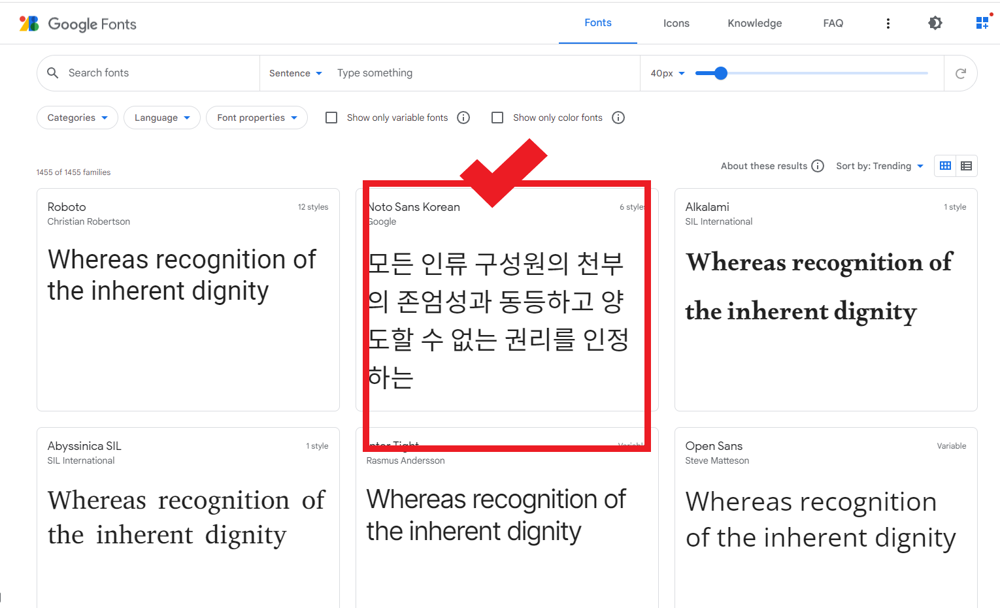
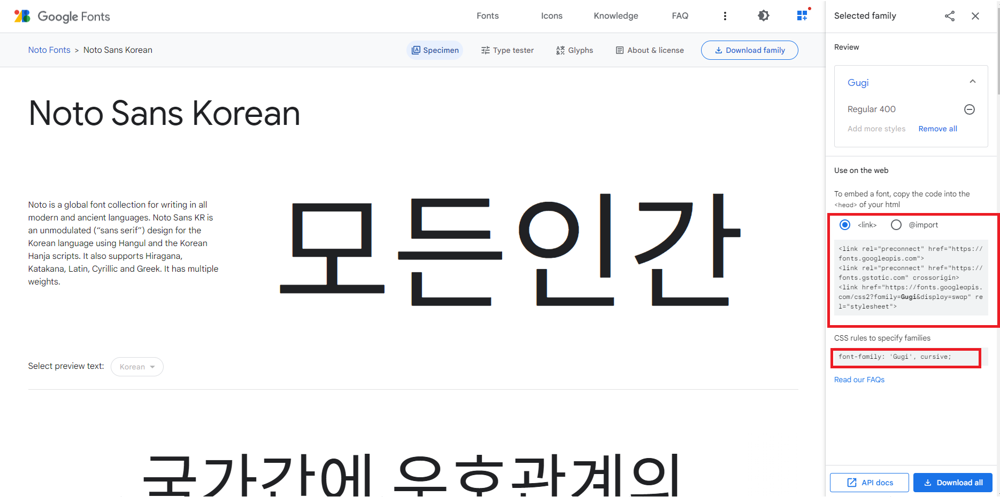
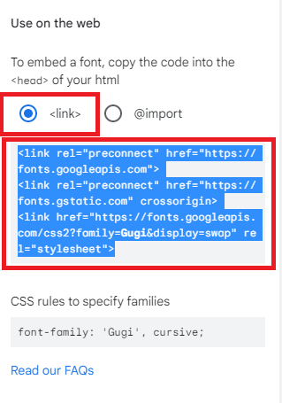
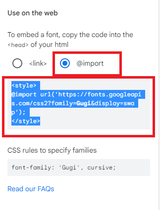
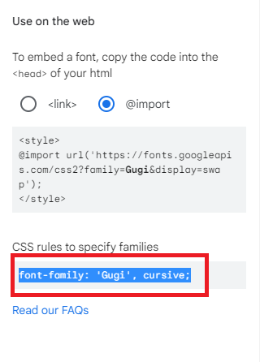

## 웹 폰트

- font-family로 지정한 글꼴은 사용자 시스템에 설치되어 있는 것만 사용할 수 있음
- MAC과 Windows에서 동일한 글꼴을 사용하기 힘들다
- 웹 문서 안에 글꼴 정보도 함께 저장했다가 사용자가 웹 문서에 접속하면 글꼴을 사용자 시스템으로 다운로드 시켜 사용하는 글꼴
- 사용자 시스템에 없는 글꼴이더라도 웹 제작자가의도한대로 텍스트를 표시할 수 있음
- 폰트 저작권 : 웹 폰트 역시 다른 폰트와 마찬가지로 라이선스를 구입해야 사용 가능하다
- 전용 글꼴
  - Microsoft : `Segoe` 로 시작하는 글꼴
  - Apple : `SF Pro` 로 시작하는 글꼴
  - Naver : 네이버 글꼴(무료제공) [https://hangeul.naver.com/font](https://hangeul.naver.com/font)

## 글꼴 적용하기

- 글꼴을 가지고 있을 경우
- 기본형

```css
@font-face {
  font-family: 폰트명 지정;
  src: url(폰트파일) format(‘형식’), ……;
}
```

- 최근에는 직접 글꼴 파일을 서버에 올려놓지 않고 이미 서버에 올라와 있는 글꼴을 링크해서 사용한다
- 기본형

```css
@import url(https://fonts.google.com/);
```

- 웹 폰트 사이트
  - 구글 폰트 [https://fonts.google.com/](https://fonts.google.com/)
  - 네이버 [https://hangeul.naver.com/](https://hangeul.naver.com/)
  - 어도비 [https://fonts.adobe.com/](https://fonts.adobe.com/)

## 웹 폰트 적용하기(실습)

1. `<link>`를 사용하여 html에 직접 적용
2. `@import`를 사용해서css에서 적용

- 공통부분
  1. [https://fonts.google.com/](https://fonts.google.com/) 접속
  2. 원하는 폰트 검색  
  
  
     
     
  3. 클래스 이름 적용
  ```html
  <h1 class="font1">HELLO</h1>
  ```
  4. 1. `<link>` 사용  
  
        
  - `<link>` 를 선택하고 블럭 한 부분을 복사 -> </head> 앞에 넣는다
  ```html
      <title>Document</title>
    <style>
      ...
    </style>
    <link rel="preconnect" href="https://fonts.googleapis.com">
    <link rel="preconnect" href="https://fonts.gstatic.com" crossorigin>
    <link href="https://fonts.googleapis.com/css2?family=Gugi&display=swap" rel="stylesheet">
  </head>
  ```

4. 2. css 사용  

      

- @import 를 선택하고 블럭 한 부분을 복사 -> css 내용 맨 위에 붙여 넣는다
  ```css
  @import url("https://fonts.googleapis.com/css2?family=Gugi&display=swap");
  ```

5. `<style>` 안에 class 적용하고 웹에 있는 font-family 적용  

   

```html
<style>
  .font1 {
    font-family: "Gugi", cursive;
  }
</style>
```

## Font Awesome

- 웹 문서에 아이콘을 사용할 때 gif파일을 따로 만들어서 사용했지만
- 최근에는 직접 아이콘을 만들지 않고 웹에 올라와 있는 아이콘을 링크해서 사용한다
  - 특수한 형태의 웹 폰트형식이나 SVG형식
  - 텍스트 형식이기 때문에 글자 크기나 색상을 조절하는 것처럼 사용가능
- 가장 많이 사용하는 아이콘 서비스가 : Font Awesome [https://fontawesome.com/](https://fontawesome.com/)
  
  ```html
  <p>
    <i class="fa-brands fa-instagram"></i>
  </p>
  ```
  - 텍스트 처럼 편집가능
  ```html
  <style>
    i {
      font-size: 30px;
      color: red;
    }
  </style>
  ```
