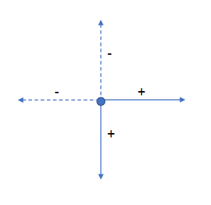
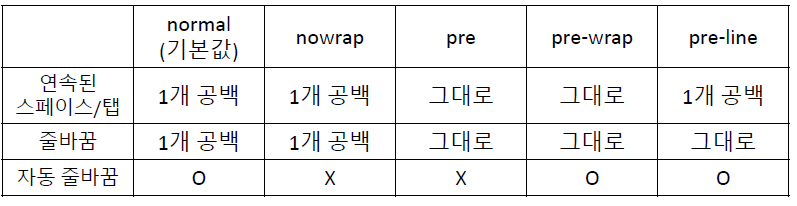
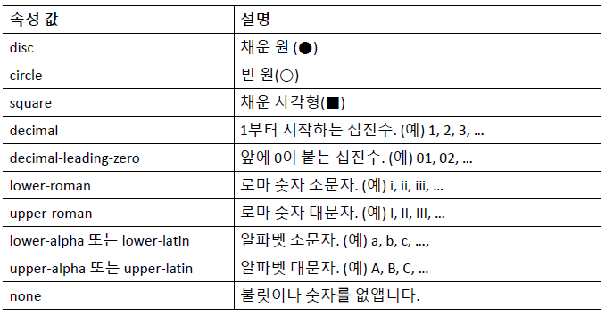

## text-align 속성

- 텍스트 정렬 방법 지정

  - start : 쓰기 방식이 ltr 이면 left와 같습니다. rtl 이면 right
  - end : 쓰기 방식이 ltr 이면 right와 같습니다. rtl 이면 left
  - left : 왼쪽에 맞추어 정렬
  - right : 오른쪽에 맞추어 정렬
  - center : 가운데에 맞추어 정렬
  - justify : 양쪽에 맞추어 정렬

  ```css
  h1 {
    text-align: center;
  }
  p {
    /*font-size: 20px;*/
    text-align: left;
  }
  ```

## line-height 속성

- 문단의 줄 간격지정
- px값을 사용할 수도 있다
- 해당 요소의 글자 크기를 기준으로 몇 배인지 숫자, 백분율로 지정
- 보통 글자 크기의 1.5 ~ 2배 정도면 적당하다

```css
p {
  /*font-size: 20px;
   text-align: left;*/
  line-height: 2;
}
```

## text-decoration 속성

- 텍스트에 밑줄을 긋거나 가로지르는 줄 표시
- 텍스트 링크에서 자동으로 생기는 밑줄을 없앨때도 사용
  - none : 줄을 표시 하지 않는다
  - underline : 밑줄을 표시한다
  - overline : 위에 줄을 표시
  - line-through : 가로지르는(취소) 선을 표시한다

## text-shadow 속성

- 텍스트에 그림자 효과를 추가하는 속성
  
  - 가로 거리 : 텍스트부터 그림자까지의 가로 거리. +는 글자의 오른쪽, -는 글자의 왼쪽에 그림자를 만든다.필수 속성
  - 세로 거리 : 텍스트부터 그림자까지의 세로 거리. +는 글자의 아래쪽, -는 글자의 위쪽에 그림자를 만든다.필수 속성
  - 번짐 정도 : 그림자의 번지는 정도. +는 그림자가 모든 방향으로 퍼져나감
  - 색상 : 그림자 색상을 지정합니다. 한 가지만 지정할 수도 있고 여러 색상을 지정할수 있습니다. 기본값은 현재 글자 색

```css
.shadow1 {
  /*background-color: #eee;
  color: green;*/
  text-shadow: 2px 1px 3px #000;
}
```

- 웹 브라우저 개발자 도구창(f12)에서 직관적으로 변화를 확인할 수 있다

## letter-spacing, word-spacing 속성

- letter-spacing : 글자간 간격
- word-spacing : 단어간 간격

```css
.text1 {
  letter-spacing: -1.5px;
}
.text2 {
  word-spacing: 3px;
}
```

## text-transform 속성

- 영문 텍스트의 대문자나 소문자를 바꾸는 속성
  - none : 변환 하지 않는다
  - capitalize : 시작하는 첫 번째 글자를 대문자로 변환한다
  - uppercase : 모든 글자를 대문자로 변환한다
  - lowercase : 모든 글자를 소문자로 변환한다
  - full-width ; 가능한 모든 문자를 전각 문자로 변환한다
  - 영문을 화면에 표시해야 할 경우, 소스에 입력할때는 소문자로 입력하고 필요할때 마다 capital, 혹은 uppercase를 적용해서 화면에 나타나는 모습을 다르게만든다
  ```css
  .trans1,
  .trans2 {
    text-transform: uppercase;
  }
  .trans3 {
    text-transform: capitalize;
  }
  ```

## white-space 속성

- 텍스트의 공백을 어떻게 처리할 것인지 지정한다
  

## text-overflow 속성

- 텍스트가 정해진 영역을 벗어날 만큼 길때 ...을 붙일지 지정한다
  - clip : 기본값, 영역을 벗어나면 그대로 자른다
  - ellipsis : 텍스트가 잘렸다는 뜻으로 ... 을 붙인다
  - fade : 영역 끝 부분에 페이드 아웃 효과를 적용한다
  ```css
  .text {
    overflow: hidden; // 영역을 벗어나는 내용은 화면에 보이지 않게 한다.
    white-space: nowrap; // 줄바꿈을 하지 않는다
    text-overflow: ellipsis; // 텍스트가 잘린 부분에 …을 붙인다.
  }
  ```

## 목록 관련 스타일

- list-style-type 속성
  - 순서 없는 목록의 불릿이나 순서 목록의 숫자를 바꾸는 속성
  ```css
  <style>
    ul {
    list-style-type: circle;
    }
  </style>
  ```
  
  
  - 불릿을 없애는 방법 
  ```css
  ul{list-style :none;}
  ```

## 표 관련 스타일

- 테두리 관련 스타일
  - 웹 문서에 표를 삽입하면 기본적으로 테두리가 그려지지 않는다
  - border : 표의 바깥 테두리와 셀 테두리 모두 지정
  - border-collapse : 표 테두리와 셀 테두리를 합칠 것인지 설정 합칠 경우 collapse 라고 지정
  ```css
  table {
    border: 1px solid #ccc;
    border-collapse: collapse;
    caption-side: bottom;
  }
  ```
