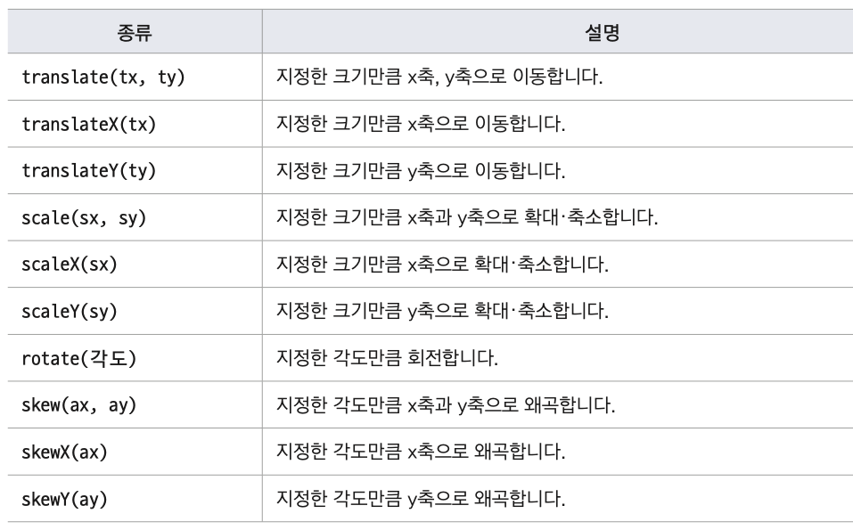
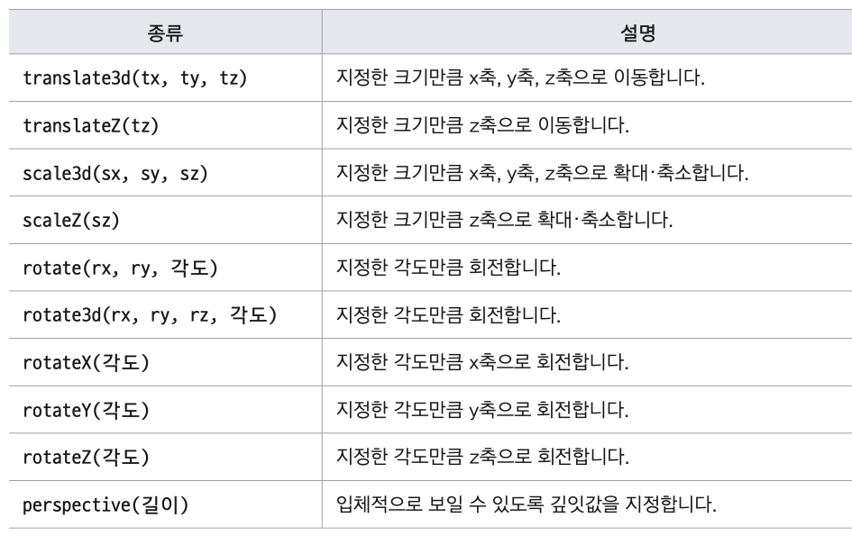
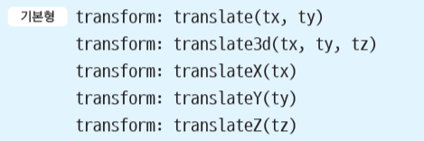
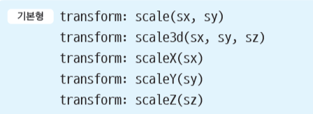

## transform

- 특정 요소의 크기나 모양이 바뀌는 것
- 예) 웹 요소를 이동시키는 병형 함수는 translate( )
- 예) 웹 요소를 x축으로 50px, y축으로 100px 이동하는 클래스 선택자 .photo
  - .photo{transform:translate(50px,100px);}
- 2차원 변형
  - 수평이나 수직으로 웹 요소 변형
  - x축으로 오른쪽으로 갈 수록, y축은 아래로 갈 수록 값이 커짐
  - 크기나 각도만 지정하면 됨
  - 2차원 좌표 사용  
    
- 3차원 변형
  - x축과 y축에 원근감 추가
  - z축은 앞뒤로 이동, 보는 사람 쪽으로 다가올 수록 값이 커짐  
    

## translate

- 이동할 거리를 지정하면 해당 요소를 이동시킨다
- 방향에 따라 사용하는 함수가 달라진다  
  
- transform:translate(tx, ty) - x축 방향으로 tx만큼, y축 방향으로 ty만큼 이동
- tx와 ty 두 가지 값을 사용하지만 ty 값이 주어지지 않으면 0으로 간주
- transform:translate3d(tx, ty, tz) - x축 방향으로 tx만큼, y축 방향으로 ty만큼,z축 방향(앞뒤)으로 tz만큼 이동
- transform:translateX(tx) - x축 방향으로 tx만큼 이동
- transform:translateY(ty) - y축 방향으로 ty만큼 이동
- transform:translateZ(tz) - z축 방향으로 tz만큼 이동

## scale

- 지정한 크기만큼의 요소를 확대/축소  
  
- transform:scale(sx, sy) - x축 방향으로 sx만큼, y축 방향으로 sy만큼 확대, sy 값이 주어지지 않는다면 sx 값과 같다고 간주.
  - 예) scale(2.0) = scale(2) = scale(2, 2) : 요소를 두 배로 확대.
- transform:scale3d(sx, sy, sz) - x축 방향으로 sx만큼, y축 방향으로 sy만큼, z축 방향으로 sz만큼 확대.
- transform:scaleX(sx) – x축 방향으로 sx만큼 확대.
- transform:scaleY(sy) - y축 방향으로 sy만큼 확대.
- transform:scaleZ(sz) -z축 방향으로 sz만큼 확대.

## rotate

- 각도 만큼 웹 요소를 시계 방향이나 시계 반대 방향으로 회전
- 시계 방향으로 회전할 때는 +값, 시계 반대 방향은 - 값
- 일반 각도(degree)나 radian값 사용 (1radian=1/180)
- degree -> radian : degree/180, radian -> degree : radian\*180
- transform : rotate(각도)

```css
#rotate: hover {
  transform: rotate(40deg);
}
```

- transform-origin
  - transform : rotate()를 사용하면 요소의 중앙을 중심으로 회전한다
  - transform-origin을 사용해서 회전 기준점을 지정할 수 있다
  ```css
  #rotate:hover {
    transform-origin: 30px 30px;
    transform: rotate(40deg);
  }
  ```

## 3차원 rotate


- perspective 속성
  - 원근감을 표현하기 위해 사용하는 속성
  - 원래 있던 위치에서 사용자가 있는 쪽으로 얼마나 이동하는지 나타냄
  - 값(px)은 0 보다 커야하면 값이 클수록 사용자로부터 멀어짐
  - perspective속성은 변형하는 요소의 부모요소에 정의해야 한다

## skew

- transform:skewX(ax) – x축을 따라 당김
- transform:skewY(ay) – y축을 따라 당김
- transform:skew(ax, ay) – 첫 번째 각도는 x축을 따라 당기는 각도이고 두 번째 각도는 y축을 따라 당기는 각도. 두 번째 값이 주어지지 않으면 y축에 대한 각도를 0으로 간주함.

## transition

- 웹의 스타일 속성이 조금씩 자연스럽게 바뀌는 액션
  

## transition-property

- 트랜지션을 적용한 속성 선택(크기,색상...etc)
- 이 속성을 지정하지 않으면 모든 속성이 트랜지션 대상이 된다  
  

```css
.box {
  transition-property: all; /* 해당 요소의 모든 속성에 트랜지션 적용*/
  transition-property: background-color; /* 해당 요소의 배경색에 트랜지션 적용*/
  transition-property: width, height; /*해당 요소의 너비오 높이에 트랜지션 적용*/
}
```

## transition-duration

- 트랜지션 진행 시간 지정
- 시간 단위는 초(sec) 또는 밀리초(milliseconds) (1s = 1000ms)
- 트랜지션이 여러 개라면 쉼표(,)로 구분해 진행 시간 지정
- 기본 값은 0s

## transition-timin-function

- 트랜지션의 시작과 중간, 끝에서의 속도 지정  
  

## transition-delay

- 트랜지션이 언제부터 시작될지 지연 시간 지정
- 시간 단위는 초(sec) 또는 밀리초(milliseconds) (1s = 1000ms)
- 기본 값은 0s

## transition 통합

- 트랜지션 관련 속성을 한꺼번에 지정
- 속성 값을 작성 하는 순서는 상관이 없음
- 시간 값 속성이 2개이므로, 앞에 오는 시간 값은 transition-duration, 뒤에 오는 시간 값은transition-delay 속성으로간주  
  

## opacity, overflow

- opacity
  - 요소의 불투명도를 설정합니다
  - 0,1 사이의 숫자 사용
    - opacity : 0 요소를 완전히 투명하게 만든다
    - opacity : 1 요소를 완전히 불투명하게 만든다
  - 자식 요소에는 상속 되지 않는다
- overflow
  - 요소의 크기보다 내용이 더 클 때 어떻게 표시할 것인지 설정
  - 사용값 : visible, hidden, scroll, auto
